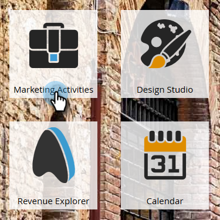
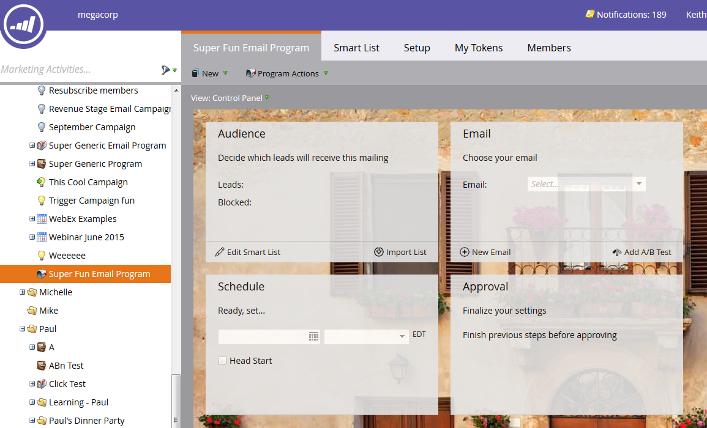

# Creare un programma e-mail {#create-an-email-program}

Utilizza i programmi e-mail per inviare in modo rapido e semplice un messaggio e-mail a un gruppo di persone.

1. Passa a **[!UICONTROL Marketing Activities]**.

   

1. Selezionare la cartella in cui si desidera creare il programma, fare clic sull&#39;elenco a discesa **[!UICONTROL New]** e selezionare **[!UICONTROL New Program]**.

   

1. Immettere un nome, selezionare **[!UICONTROL Email]** come [!UICONTROL Program Type] e fare clic su **[!UICONTROL Create]**.

   

   >[!NOTE]
   >
   >Quando si seleziona **[!UICONTROL Email]** come tipo di programma, il canale verrà automaticamente impostato su **[!UICONTROL Email Send]**. Puoi cambiarla se vuoi.

   

Bello! Il programma è ora nella struttura ed è pronto per essere utilizzato. Il passaggio successivo consiste nel definire il pubblico. Consulta gli articoli correlati a Marketo di seguito.

>[!MORELIKETHIS]
>
>* [Definisci un pubblico con un elenco avanzato](/help/marketo/product-docs/email-marketing/email-programs/managing-people-in-email-programs/define-an-audience-with-a-smart-list.md)
>* [Definire un pubblico importando un elenco](/help/marketo/product-docs/email-marketing/email-programs/managing-people-in-email-programs/define-an-audience-by-importing-a-list.md)
