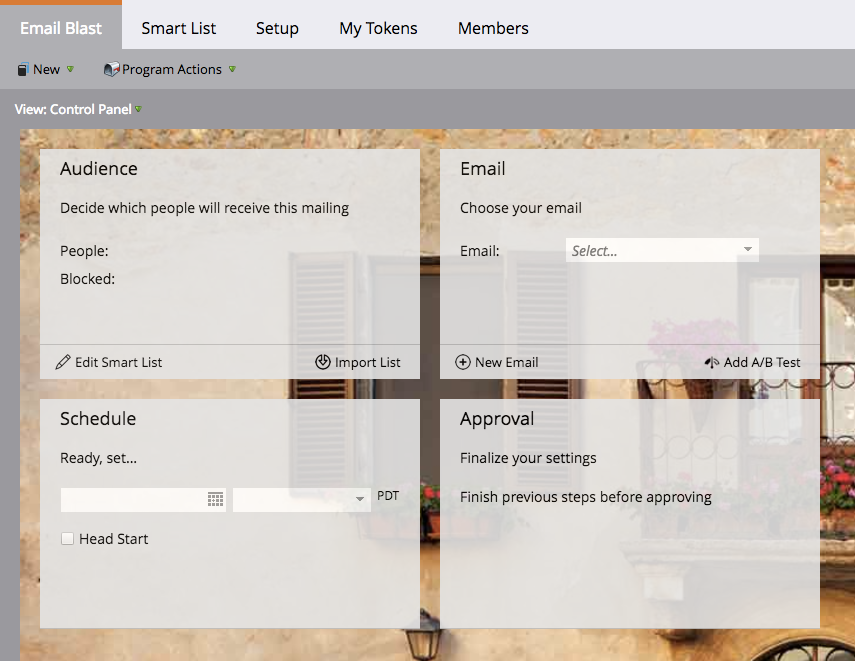

# Informazioni sui programmi e-mail {#understanding-email-programs}

Saluta il tuo nuovo amico Marketo, il programma e-mail. Invia e-mail, crea test A/B e monitora i risultati in un’unica posizione.

## Pannello di controllo Campaign {#control-panel}

Quattro scatole ti tengono concentrato. **Pubblico** definisce il &quot;chi&quot;, **E-mail** fornisce il &quot;cosa&quot;, **Pianificazione** definisce &quot;quando&quot;, &quot;quando&quot; e &quot;quando&quot; **Approvazione** lo rende pronto ad andare.

## Test A/B {#a-b-testing}

Il test A/B ti consente di dimostrare quale è l’e-mail migliore.

Scopri i seguenti test A/B:

* [Test A/B &quot;Subject Line&quot;](/help/marketo/product-docs/email-marketing/email-programs/email-program-actions/email-test-a-b-test/use-subject-line-a-b-testing.md)
* [Test A/B &quot;per e-mail intera&quot;](/help/marketo/product-docs/email-marketing/email-programs/email-program-actions/email-test-a-b-test/use-whole-email-a-b-testing.md)
* [Test A/B &quot;Da indirizzo&quot;](/help/marketo/product-docs/email-marketing/email-programs/email-program-actions/email-test-a-b-test/use-from-address-a-b-testing.md)
* [Test A/B &quot;Data/ora&quot;](/help/marketo/product-docs/email-marketing/email-programs/email-program-actions/email-test-a-b-test/use-date-time-a-b-testing.md)

## Dashboard {#dashboards}

>[!TIP]
>
>Alcuni preferiscono utilizzare i programmi e-mail rispetto all’invio di un’e-mail tramite una campagna intelligente, a causa del dashboard dettagliato di reporting del programma.

Godetevi i frutti del vostro lavoro. Le dashboard mostrano immediatamente le prestazioni del programma e-mail e del test A/B.

## Nidificazione {#nesting}

I programmi e-mail giocano bene con altri programmi.

Utilizza un programma e-mail per inviare un invito a un webinar, ad esempio.

Utilizza un programma e-mail all’interno di un programma predefinito per mantenere le cose organizzate.

>[!TIP]
>
>Per ottenere un programma e-mail esistente in un altro programma, devi clonarlo.

>[!NOTE]
>
>I programmi e-mail non possono essere nidificati in [programmi di coinvolgimento](/help/marketo/getting-started/quick-wins/drip-drip-nurture.md). Inoltre, non possono essere re-inviati e possono eseguire un solo test alla volta.

## Impostazioni pianificazione {#schedule-settings}

Dopo aver compreso i programmi e-mail, inizia con uno degli articoli correlati riportati di seguito.

>[!MORELIKETHIS]
>
>* [Creare un programma e-mail](/help/marketo/product-docs/email-marketing/email-programs/creating-an-email-program/create-an-email-program.md)
>
>* [Definire un pubblico con un elenco avanzato](/help/marketo/product-docs/email-marketing/email-programs/managing-people-in-email-programs/define-an-audience-with-a-smart-list.md)
>* [Creare un messaggio e-mail per un programma e-mail](/help/marketo/product-docs/email-marketing/email-programs/email-program-actions/create-an-email-for-an-email-program.md)
>* [Programma e-mail](/help/marketo/product-docs/email-marketing/email-programs/email-program-actions/schedule-your-email-program.md)

