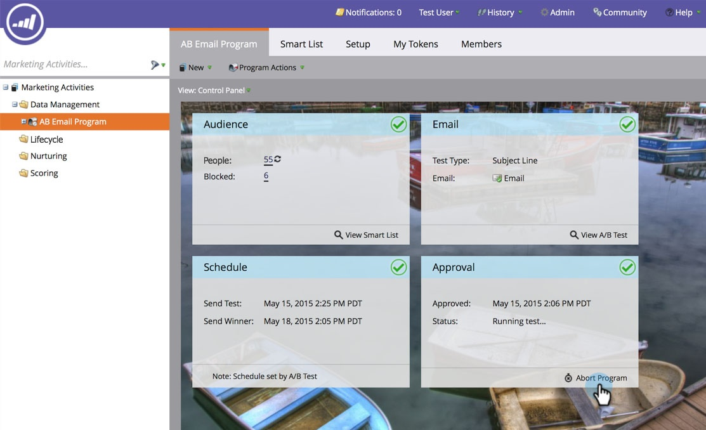

# Interrompi programma e-mail {#abort-email-program}

Ops! Premi il freno! Questo programma e-mail non deve uscire.

>[!NOTE]
>
>Questo articolo ha lo scopo di aiutarti a impedire che le e-mail escano prima che vengano inviate. Non è possibile richiamare le e-mail inviate.

1. In un programma e-mail, fai clic su **Interrompi programma**.

   

1. Clic **Interrompi** per una conferma completa.

   

1. Viene visualizzata un’intestazione di avviso che indica che il programma e-mail è stato interrotto.

   

   >[!CAUTION]
   >
   >Una volta interrotto, il programma e-mail non può essere ripianificato.

Ehi! Non ti fa piacere poter evitare questi costosi errori?
