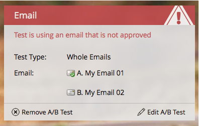

# Approvare/annullare l’approvazione di un programma e-mail {#approve-unapprove-an-email-program}

>[!PREREQUISITES]
>
>* [Creare un programma e-mail](/help/marketo/product-docs/email-marketing/email-programs/creating-an-email-program/create-an-email-program.md)
>* [Definire un pubblico con un elenco avanzato](/help/marketo/product-docs/email-marketing/email-programs/managing-people-in-email-programs/define-an-audience-with-a-smart-list.md) o [Definire un pubblico importando un elenco](/help/marketo/product-docs/email-marketing/email-programs/managing-people-in-email-programs/define-an-audience-by-importing-a-list.md)
>
>* [Scegli un’e-mail esistente](/help/marketo/product-docs/email-marketing/email-programs/email-program-actions/choose-an-existing-email.md) o [Creare un messaggio e-mail per un programma e-mail](/help/marketo/product-docs/email-marketing/email-programs/email-program-actions/create-an-email-for-an-email-program.md)
>
>* [Programma e-mail](/help/marketo/product-docs/email-marketing/email-programs/email-program-actions/schedule-your-email-program.md)

## Approva il tuo programma e-mail {#approve-your-email-program}

Ora che il programma è pronto, il passo finale è quello di approvarlo. Ecco come:

1. Vai a **Attività di marketing**.

   

   Seleziona il tuo programma e-mail.
   

   >[!CAUTION]
   >
   >Se non approvi il tuo programma e-mail, l’e-mail non verrà inviata.

1. Sotto la **Approvazione** riquadro andare avanti e fare clic su **Approva programma**.

   

1. Se trovi problemi, ti faremo sapere - correggili e prova di nuovo ad approvare.

   

   Perfetto! Ha finito. L’e-mail verrà inviata all’ora pianificata.

   

## Annullare l’approvazione del programma e-mail {#unapprove-your-email-program}

Se cambi idea e decidi di non volerlo uscire, puoi disapprovare il programma e-mail.

1. Vai a **Attività di marketing**.

   

1. Seleziona il tuo programma e-mail.

   

1. Sotto la **Approvazione** riquadro, semplicemente clicca **Annulla approvazione programma**.

   

Fatto! L&#39;e-mail non verrà inviata fino a quando non la approverai nuovamente.
