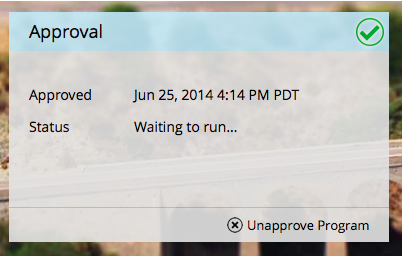

# Approvare/annullare l&#39;approvazione di un programma e-mail {#approve-unapprove-an-email-program}

>[!PREREQUISITES]
>
>* [Creare un programma e-mail](/help/marketo/product-docs/email-marketing/email-programs/creating-an-email-program/create-an-email-program.md)
>* [Definire un pubblico con un ](/help/marketo/product-docs/email-marketing/email-programs/managing-people-in-email-programs/define-an-audience-with-a-smart-list.md) elenco avanzato  [Definire un pubblico importando un elenco](/help/marketo/product-docs/email-marketing/email-programs/managing-people-in-email-programs/define-an-audience-by-importing-a-list.md)

   >
   >
* [Scegliere un ](/help/marketo/product-docs/email-marketing/email-programs/email-program-actions/choose-an-existing-email.md) e-mail esistente o  [creare un&#39;e-mail per un programma e-mail](/help/marketo/product-docs/email-marketing/email-programs/email-program-actions/create-an-email-for-an-email-program.md)
   >
   >
* [Pianificazione del programma e-mail](/help/marketo/product-docs/email-marketing/email-programs/email-program-actions/schedule-your-email-program.md)

## Approva il programma e-mail {#approve-your-email-program}

Ora che il programma è pronto, il passo finale è quello di approvarlo. Di seguito è riportata la procedura seguente:

1. Andate a **Marketing Activities**.

   

   Selezionate il programma e-mail.
   

   >[!CAUTION]
   >
   >Se non approvi il tuo programma di posta elettronica, l&#39;e-mail non uscirà.

1. Nella sezione **Approvazione** fare clic su **Approva programma**.

   

1. Se troviamo dei problemi, ti faremo sapere - correggili e prova a approvarli di nuovo.

   

   Perfetto! Hai finito. L&#39;e-mail verrà inviata all&#39;ora pianificata.

   

## Disapprovare il programma e-mail {#unapprove-your-email-program}

Se cambi idea e decidi di non volerne uscire, puoi disapprovare il programma e-mail.

1. Andate a **Marketing Activities**.

   

1. Selezionate il programma e-mail.

   

1. Nella sezione **Approvazione**, fare clic su **Disapprova programma**.

   

Fatto! La tua email non uscirà finché non la approverai di nuovo.
