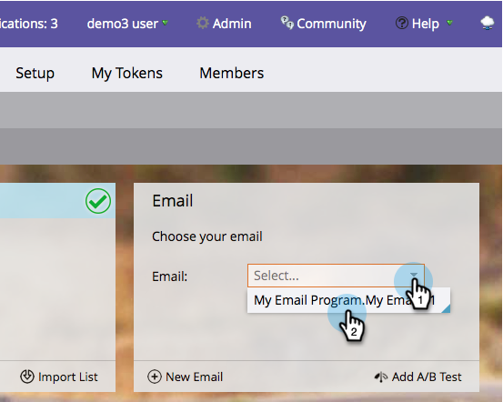
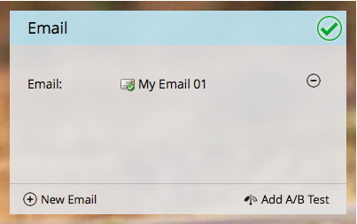

# Scegliere un’e-mail esistente {#choose-an-existing-email}

>[!PREREQUISITES]
>
>* [Crea un programma di posta elettronica](/help/marketo/product-docs/email-marketing/email-programs/creating-an-email-program/create-an-email-program.md)
>* [Definire un pubblico con un elenco avanzato](/help/marketo/product-docs/email-marketing/email-programs/managing-people-in-email-programs/define-an-audience-with-a-smart-list.md) o [Definire un pubblico importando un elenco](/help/marketo/product-docs/email-marketing/email-programs/managing-people-in-email-programs/define-an-audience-by-importing-a-list.md)

>[!CAUTION]
>
>Per ottenere rapporti accurati, evita di _riutilizzare_ un&#39;e-mail da un programma e-mail, facendo riferimento ad essa in una campagna avanzata o spostando la risorsa dal programma e-mail avviato a uno nuovo. In questo modo, verranno aggregati tutti i dati in ogni dashboard di reporting associato a tale e-mail. Se devi riutilizzare un&#39;e-mail, [clonala](/help/marketo/product-docs/core-marketo-concepts/programs/working-with-programs/clone-an-asset-in-a-program.md){target="_blank"}, in quanto copia l&#39;e-mail ma ne crea una nuova con un nuovo ID e-mail.

Dopo aver [creato un programma di posta elettronica](/help/marketo/product-docs/email-marketing/email-programs/creating-an-email-program/create-an-email-program.md) e definito il pubblico, sarà necessario decidere quale e-mail si sta inviando. Puoi [creare un&#39;e-mail per un programma e-mail](/help/marketo/product-docs/email-marketing/email-programs/email-program-actions/create-an-email-for-an-email-program.md) da zero o sceglierne una già esistente. Ecco come sceglierne uno che esiste già.

1. Passa a **[!UICONTROL Marketing Activities]**.

   

1. Trova e seleziona il programma e-mail.

   

1. Nella sezione **[!UICONTROL Email]**, seleziona quella che desideri inviare.

   

   >[!NOTE]
   >
   >È possibile selezionare solo e-mail locali. Spostare un messaggio e-mail da un programma a un altro? [Scopri come](/help/marketo/product-docs/email-marketing/email-programs/email-program-actions/move-an-email.md).

   Dolce!

   

Ora che abbiamo deciso quale e-mail inviare, possiamo impostare un test A/B o saltarlo e pianificare il programma e-mail.

>[!MORELIKETHIS]
>
>* [Aggiungi un test A/B](/help/marketo/product-docs/email-marketing/email-programs/email-program-actions/email-test-a-b-test/add-an-a-b-test.md)
>* [Pianifica Il Programma Di Posta Elettronica](/help/marketo/product-docs/email-marketing/email-programs/email-program-actions/schedule-your-email-program.md)
