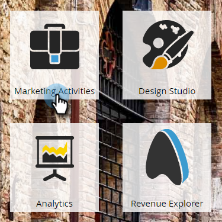
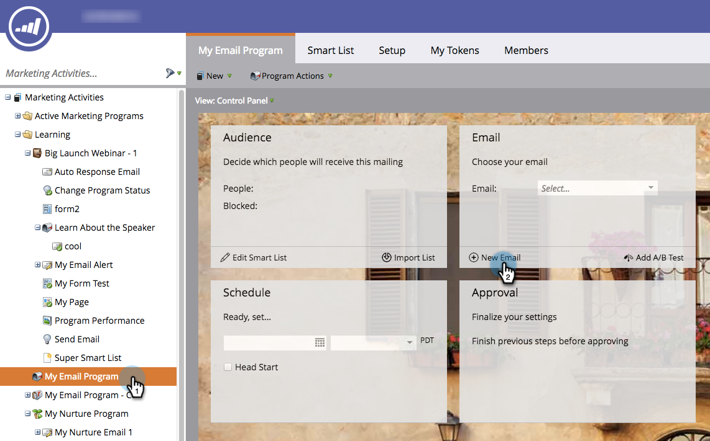

# Creare un’e-mail per un programma e-mail {#create-an-email-for-an-email-program}

>[!PREREQUISITES]
>
>* [Crea un programma di posta elettronica](/help/marketo/product-docs/email-marketing/email-programs/creating-an-email-program/create-an-email-program.md)
>* [Definire un pubblico con un elenco avanzato](/help/marketo/product-docs/email-marketing/email-programs/managing-people-in-email-programs/define-an-audience-with-a-smart-list.md) o [Definire un pubblico importando un elenco](/help/marketo/product-docs/email-marketing/email-programs/managing-people-in-email-programs/define-an-audience-by-importing-a-list.md)

Dopo aver creato il programma e-mail e definito il pubblico, decidi quale e-mail stai inviando. Puoi [scegliere un&#39;e-mail esistente](/help/marketo/product-docs/email-marketing/email-programs/email-program-actions/choose-an-existing-email.md) o crearne una da zero. Ecco come creare una nuova e-mail.

1. Passa a **[!UICONTROL Marketing Activities]**.

   

1. Seleziona il programma e-mail. Nel riquadro **[!UICONTROL Email]** fare clic su **[!UICONTROL New Email]**.

   

1. Immetti un **[!UICONTROL Name]**, seleziona il modello desiderato e fai clic su **[!UICONTROL Create]**.

   

1. Apporta tutte le modifiche desiderate e chiudi dall’editor.

   

   >[!NOTE]
   >
   >Scopri come [modificare gli elementi in un messaggio e-mail](/help/marketo/product-docs/email-marketing/general/email-editor-2/edit-elements-in-an-email.md).

1. Non dimenticare di approvare l’e-mail.

   

Fantastico! Dopo aver creato un&#39;e-mail da inviare, [aggiungi un test A/B](/help/marketo/product-docs/email-marketing/email-programs/email-program-actions/email-test-a-b-test/add-an-a-b-test.md) o passa direttamente a [pianificazione del programma e-mail](/help/marketo/product-docs/email-marketing/email-programs/email-program-actions/schedule-your-email-program.md).
