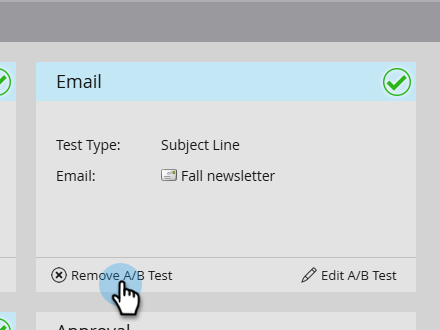

# Annullare il test A/B {#cancel-the-a-b-test}

Se hai [aggiunto un test A/B](/help/marketo/product-docs/email-marketing/email-programs/email-program-actions/email-test-a-b-test/add-an-a-b-test.md) al tuo programma e-mail e hai deciso di non volerlo più, è facile annullarlo. Ecco come.

1. Passa a **[!UICONTROL Marketing Activities]**.

   

1. Seleziona il programma e-mail.

   

1. Nel riquadro **[!UICONTROL Email]** fare clic su **[!UICONTROL Remove A/B Test]**.

   

   >[!NOTE]
   >
   >Prima di poter rimuovere il test A/B, il programma e-mail non deve essere approvato. Per ulteriori informazioni, vedere [Approvare/Annullare l&#39;approvazione di un programma di posta elettronica](/help/marketo/product-docs/email-marketing/email-programs/email-program-actions/approve-unapprove-an-email-program.md).
