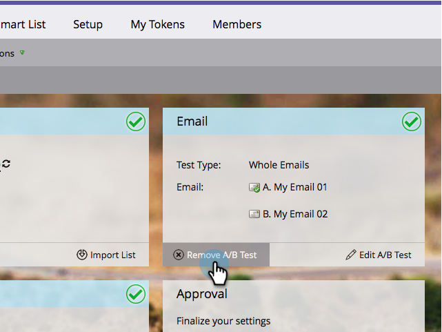

# Annulla il test A/B {#cancel-the-a-b-test}

Se hai  [aggiunto un test A/B](/help/marketo/product-docs/email-marketing/email-programs/email-program-actions/email-test-a-b-test/add-an-a-b-test.md) al tuo programma e-mail e hai deciso che non lo desideri più, è facilmente annullabile. Ecco come.

1. Vai a **Attività di marketing**.

   

1. Seleziona il programma e-mail.

   

1. Sotto **E-mail** riquadro, fai clic su **Rimuovi test A/B**.

   

   >[!NOTE]
   >
   >Prima di poter rimuovere il test A/B, il programma e-mail non deve essere approvato. Consulta [Approvare/Annullare l’approvazione di un programma e-mail](/help/marketo/product-docs/email-marketing/email-programs/email-program-actions/approve-unapprove-an-email-program.md) per i dettagli.

Facile!
