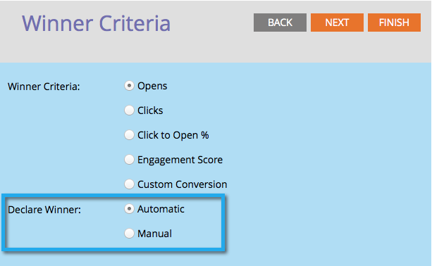

# Definire i criteri vincitori del test A/B {#define-the-a-b-test-winner-criteria}

Quando [aggiunta di un test A/B](/help/marketo/product-docs/email-marketing/email-programs/email-program-actions/email-test-a-b-test/add-an-a-b-test.md){target=&quot;_blank&quot;} al tuo programma di posta elettronica, dovrai scegliere un tipo di test, [programmare il test A/B](/help/marketo/product-docs/email-marketing/email-programs/email-program-actions/email-test-a-b-test/schedule-the-a-b-test.md){target=&quot;_blank&quot;}, quindi definisci i criteri del vincitore. Ecco come decidere quale e-mail vince.

>[!PREREQUISITES]
>
>[Aggiungere un test A/B](/help/marketo/product-docs/email-marketing/email-programs/email-program-actions/email-test-a-b-test/add-an-a-b-test.md){target=&quot;_blank&quot;}

## Criteri vincenti {#winner-criteria}

1. Il valore predefinito **Criteri vincenti** le opzioni sono elencate per prime.

   

   <table>
   <tr>
   <td><b>Aperture</b></td>
   <td>Una pagina aperta si registra quando le immagini vengono scaricate in un messaggio e-mail. Anche se non si include un’immagine, per impostazione predefinita Marketo inserisce un singolo pixel di tracciamento in tutte le e-mail di HTML.</td>
   </tr>
   <tr>
   <td><b>Clic</b></td>
   <td>Per impostazione predefinita, i collegamenti nelle e-mail hanno il tracciamento incorporato al loro interno, che consente di vedere chi ha fatto clic sul collegamento, quanti collegamenti totali sono stati selezionati, ecc.</td>
   </tr>
   <tr>
   <td><b>Fare clic per aprire %</b></td>
   <td>Percentuale di e-mail aperte con un collegamento selezionato nell’e-mail. Questo misura la pertinenza e il contesto di un’e-mail prendendo il numero di clic univoci diviso per il numero di aperture univoche, e poi moltiplicandolo per 100 per mostrarlo come percentuale.</td>
   </tr>
   <tr>
   <td><b>Punteggio di coinvolgimento</b></td>
   <td>La <a href="https://experienceleague.adobe.com/docs/marketo/using/product-docs/email-marketing/drip-nurturing/reports-and-notifications/understanding-the-engagement-score.html" target="_blank">punteggio di coinvolgimento</a> consente di determinare l’efficacia del contenuto.</td>
   </tr>
   </table>

   >[!TIP]
   >
   >Se scegli Punteggio di coinvolgimento, il test dovrà essere eseguito per almeno 24 ore. Ulteriori informazioni [comprensione del punteggio di coinvolgimento](/help/marketo/product-docs/email-marketing/drip-nurturing/reports-and-notifications/understanding-the-engagement-score.md){target=&quot;_blank&quot;}.

1. Puoi anche personalizzare i criteri selezionando Conversione personalizzata e facendo clic su Modifica.

   

   >[!NOTE]
   >
   >La conversione personalizzata consente di scegliere qualsiasi evento come conversione utilizzando attivatori e filtri.

1. Si aprirà una finestra. Trova il trigger desiderato e trascinalo nell’area di lavoro.

   

1. Definisci il trigger.

   

   >[!IMPORTANT]
   >
   >Marketo consente solo attivatori/filtri per le persone a cui è stato inviato il messaggio e-mail da questo programma e-mail, quindi non è necessario aggiungere un filtro &quot;È stato inviato un messaggio e-mail&quot;. Inoltre, quando utilizzi un trigger/filtro relativo all’e-mail, assicurati di utilizzare &quot;is any&quot; come operatore .

1. Fai clic su **Chiudi**.

   

   Fantastico! Ora è il momento di decidere come viene determinato il vincitore.

## Dichiara vincitore {#declare-winner}

1. Selezionare una delle due opzioni disponibili.

   

   >[!NOTE]
   >
   >Se stai facendo un **Data/ora** Test A/B, puoi solo scegliere **Manuale**.

   Al termine del test A/B, Marketo può inviare automaticamente l&#39;e-mail vincente all&#39;ora pianificata oppure puoi esaminare i risultati e decidere quale e-mail inviare.

1. Automatico è fantastico ed è l&#39;opzione predefinita. Fai clic su **Successivo**.

   

   >[!TIP]
   >
   >Scelta **Manuale** invierà il test e ti aspetterà di dichiarare un vincitore. Riceverai un rapporto dei risultati.

Perfetto! Ora... [programmare il test A/B](/help/marketo/product-docs/email-marketing/email-programs/email-program-actions/email-test-a-b-test/schedule-the-a-b-test.md){target=&quot;_blank&quot;}.
