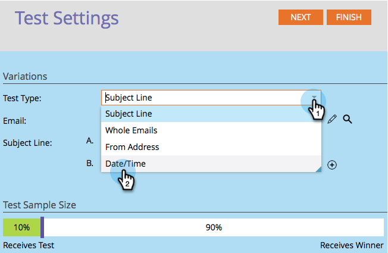

# Usa test A/B &quot;Data/ora&quot; {#use-date-time-a-b-testing}

È possibile testare facilmente le e-mail mediante test A/B. Una delle prove è la **Date/Time **test. Questo consente di verificare l&#39;ora del giorno o del giorno della settimana migliore per l&#39;invio delle e-mail. Ecco come impostarlo.

>[!PREREQUISITES]
>
>* [Aggiungere un test A/B](add-an-a-b-test.md)

>

1. Nella sezione **E-mail**, fare clic su **Aggiungi test A/B**.

   

1. Si apre una nuova finestra. Selezionare **Data/Ora** per **Tipo di test**.

   

1. Se disponete delle informazioni di test precedenti (come un test oggetto), potete fare clic su **Reset Test** in modo sicuro.

   

1. Seleziona la data della prima data/ora.

   

1. Seleziona l’ora della prima data/ora.

   

1. Esegue le stesse operazioni per la seconda data/ora.

   

1. Usate il cursore per scegliere la percentuale di pubblico desiderata nel test A/B e fate clic su **Next**.

   

   >[!NOTE]
   >
   >Le diverse varianti si applicano a parti uguali della dimensione del campione di prova scelta.

   >[!CAUTION]
   >
   >**È consigliabile evitare di impostare la dimensione del campione su 100%**. Se usate un elenco statico, impostando la dimensione del campione su 100% l’e-mail viene inviata a tutti gli utenti e il vincitore non viene inviato a nessuno. Se si utilizza un elenco **smart**, impostando la dimensione del campione su 100%, l&#39;e-mail viene inviata a tutti gli utenti *in quel momento. *Quando il programma e-mail verrà eseguito di nuovo in un secondo momento, tutte le nuove persone idonee all&#39;elenco smart riceveranno anche l&#39;e-mail, dal momento che ora sono incluse nel pubblico.

   [definire i criteri per il vincitore del test A/B](define-the-a-b-test-winner-criteria.md)

   >[!MORELIKETHIS]
   >
   >
   >    
   >    
   >    * [Definire i criteri vincitori del test A/B](define-the-a-b-test-winner-criteria.md)

Ok, siamo un passo più vicini. Ora dobbiamo farlo.