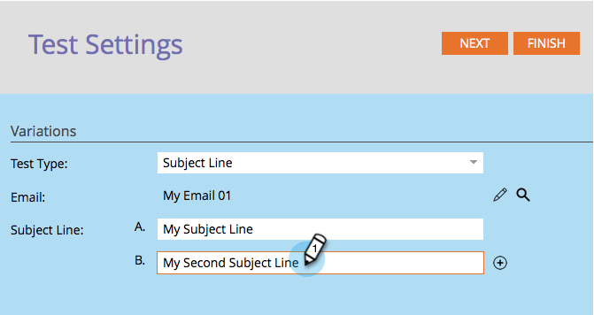

# Usa test A/B &quot;Subject Line&quot; {#use-subject-line-a-b-testing}

Puoi testare facilmente le tue e-mail tramite A/B. Uno dei test più comuni è il **Linea oggetto** test.

>[!PREREQUISITES]
>
>[Aggiungere un test A/B](/help/marketo/product-docs/email-marketing/email-programs/email-program-actions/email-test-a-b-test/add-an-a-b-test.md)

1. Nella sezione E-mail, con l’e-mail selezionata, fai clic su Aggiungi test A/B .

1. Viene aperta la finestra dell’editor di test. Immettere una o più nuove righe oggetto.

   >[!NOTE]
   >
   >Scelta **A** verrà precompilato con le informazioni contenute nel messaggio e-mail selezionato.

   

   >[!TIP]
   >
   >Puoi fare clic sul pulsante **+** per aggiungere altre righe oggetto.

1. Utilizza il cursore per scegliere la percentuale di pubblico che desideri ricevere il test A/B e fai clic su **Successivo**.

   

   >[!CAUTION]
   >
   >**Evita di impostare la dimensione del campione su 100%**. Se utilizzi un elenco statico, l’impostazione della dimensione del campione su 100% invierà l’e-mail a tutti i tipi di pubblico e il vincitore non andrà a nessuno. Se utilizzi un elenco avanzato, l’impostazione della dimensione del campione su 100% invierà l’e-mail a tutti i tipi di pubblico _a quell&#39;ora_. E quando il programma e-mail viene eseguito di nuovo in una data successiva, anche tutte le nuove persone che si qualificano per l’elenco smart riceveranno l’e-mail in quanto ora sono incluse nel pubblico.

   >[!NOTE]
   >
   >Le diverse varianti del soggetto prendono parti uguali della dimensione del campione di prova selezionata.

   Ok, ci siamo quasi. Ora dobbiamo [definire i criteri del vincitore del test A/B](/help/marketo/product-docs/email-marketing/email-programs/email-program-actions/email-test-a-b-test/define-the-a-b-test-winner-criteria.md).
