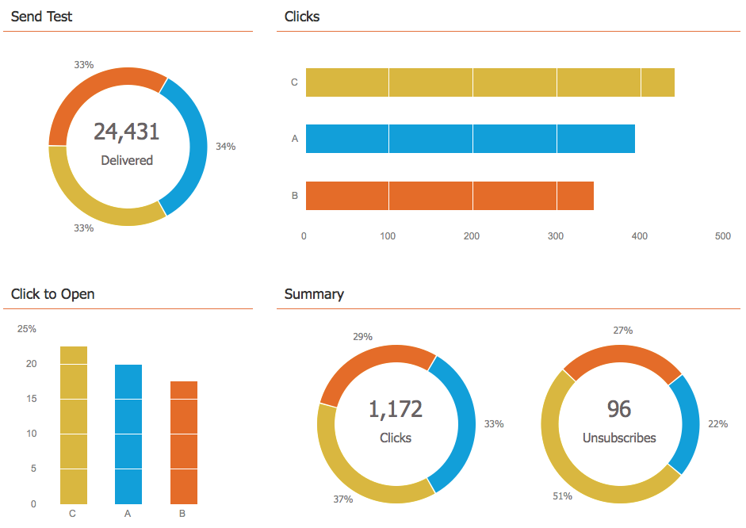

# Utilizzare la dashboard del programma e-mail - Visualizzazione test A/B {#use-the-email-program-dashboard-a-b-test-view}

Scopri come [test A/B del programma e-mail](/help/marketo/product-docs/email-marketing/email-programs/email-program-actions/email-test-a-b-test/add-an-a-b-test.md) esegue questa dashboard.

## Invia test {#send-test}

Qui puoi vedere il totale consegnato e le suddivisioni per varianti.

## Clic {#clicks}

Qui puoi vedere quanti clic ha ogni variante.

## Fare clic per aprire {#click-to-open}

Questo grafico mostra il rapporto di clic per aprire. (# clic / n aperture).

## Riepilogo {#summary}

Qui puoi vedere una suddivisione di clic e annullamenti dell’abbonamento per varianti per un semplice confronto.

Bel cruscotto, non pensa?

>[!MORELIKETHIS]
>
>[Utilizzare il dashboard del programma e-mail](/help/marketo/product-docs/email-marketing/email-programs/email-program-data/use-the-email-program-dashboard.md)
