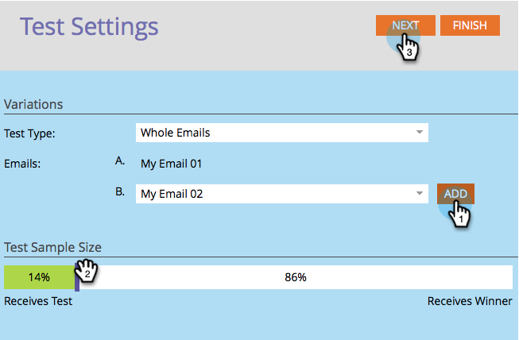

# Usa test A/B per &quot;E-mail intera&quot; {#use-whole-email-a-b-testing}

È possibile testare facilmente le e-mail mediante test A/B. Un ottimo test è l&#39; **intero test Email** . Ecco come impostarlo.

>[!NOTE]
>
>**Prerequisiti**
>
>* [Aggiungere un test A/B](add-an-a-b-test.md)

>

1. Nella sezione E-mail, con l’e-mail selezionata, fate clic su Aggiungi test A/B.

` 

`

1. Si apre una nuova finestra. Fate clic sul menu a discesa Tipo **di** test e selezionate E-mail **** intere.

   

1. Se disponete delle informazioni di test precedenti (come un test oggetto), potete fare clic su **Ripristina test** in modo sicuro.

   

1. Selezionate il primo messaggio e-mail.

   

1. Fate clic su **Aggiungi** per applicare il messaggio e-mail.

   ` 

   `

   >[!TIP]
   >
   >Potete aggiungere più e-mail. Tuttavia, se ne aggiungete troppi, il processo di test potrebbe risultare rallentato.

1. Selezionate il secondo messaggio e-mail.

   ` 

   `

1. Fate clic su **Aggiungi** per applicare il secondo messaggio e-mail. Trascinate il cursore per scegliere la percentuale di pubblico per il quale desiderate ricevere il test A/B e fate clic su **Avanti**.

   ` 

   `

   >[!NOTE]
   >
   >Le diverse varianti invieranno a parti uguali delle dimensioni **del campione di** prova prescelte.

   >[!CAUTION]
   >
   >**È consigliabile evitare di impostare la dimensione del campione su 100%**. Se usate un elenco statico, impostando la dimensione del campione su 100% l’e-mail viene inviata a tutti gli utenti e il vincitore non viene inviato a nessuno. Se utilizzi un elenco **avanzato** , l&#39;impostazione della dimensione del campione su 100% invia l&#39;e-mail a tutti gli utenti *in quel momento. *Quando il programma e-mail verrà eseguito di nuovo in un secondo momento, tutte le nuove persone idonee all&#39;elenco smart riceveranno anche l&#39;e-mail, dal momento che ora sono incluse nel pubblico.

   Ok, siamo quasi lì. Ora è necessario [definire i criteri](define-the-a-b-test-winner-criteria.md)per i vincitori del test A/B.

   >[!NOTE]
   >
   >**Articoli correlati**
   >
   >    
   >    
   >    * [Definire i criteri vincitori del test A/B](define-the-a-b-test-winner-criteria.md)

