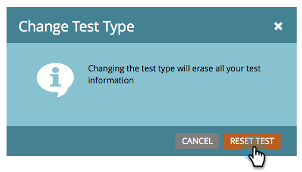

# Utilizzare il test A/B per &quot;E-mail intera&quot; {#use-whole-email-a-b-testing}

Puoi testare facilmente le tue e-mail tramite A/B. Un grande test è il **E-mail completa** test. Ecco come configurarlo.

>[!PREREQUISITES]
>
>[Aggiungere un test A/B](/help/marketo/product-docs/email-marketing/email-programs/email-program-actions/email-test-a-b-test/add-an-a-b-test.md)

1. Nella sezione E-mail, con l’e-mail selezionata, fai clic su **Aggiungi test A/B**.

1. Si apre una nuova finestra. Fai clic sul pulsante **Tipo di test** a discesa e seleziona **E-mail intere**.

   

1. Se disponi di informazioni di test precedenti (come un test del soggetto), puoi tranquillamente fare clic su **Ripristina test**.

   

1. Seleziona il tuo primo messaggio e-mail.

   

1. Fai clic su **Aggiungi** per applicare l’e-mail.

   

   >[!TIP]
   >
   >Puoi aggiungere più e-mail. Tuttavia, se ne aggiungi troppi, può rallentare il processo di test molto in basso.

1. Seleziona il tuo secondo messaggio e-mail.

   

1. Fai clic su **Aggiungi** per applicare il secondo messaggio e-mail. Trascina il cursore per scegliere la percentuale di pubblico che desideri ricevere il test A/B e fai clic su **Successivo**.

   

   >[!NOTE]
   >
   >Le diverse varianti invieranno a parti uguali della scelta **Dimensione del campione del test**.

   >[!CAUTION]
   >
   >**Evita di impostare la dimensione del campione su 100%**. Se utilizzi un elenco statico, l’impostazione della dimensione del campione su 100% invia l’e-mail a tutti i tipi di pubblico e il vincitore non arriva a nessuno. Se utilizzi un **intelligente** elenco , se imposti la dimensione del campione su 100% , invia l’e-mail a tutti gli utenti del pubblico _a quell&#39;ora_. Quando il programma e-mail viene eseguito di nuovo in una data successiva, anche tutte le nuove persone che si qualificano per l’elenco smart riceveranno l’e-mail in quanto ora sono incluse nel pubblico.

   Ok, ci siamo quasi. Ora dobbiamo [definire i criteri del vincitore del test A/B](/help/marketo/product-docs/email-marketing/email-programs/email-program-actions/email-test-a-b-test/define-the-a-b-test-winner-criteria.md).
