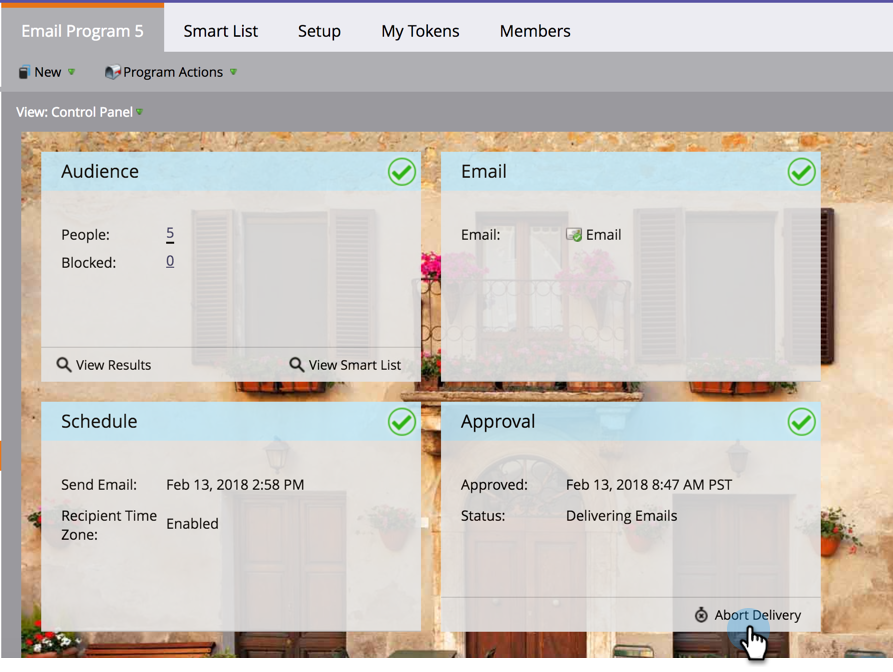

# Interrompi consegna programmi e-mail pianificati con fuso orario destinatario {#abort-delivery-of-email-programs-scheduled-with-recipient-time-zone}

In casi di emergenza, puoi interrompere la consegna di un programma e-mail già in esecuzione con l&#39;opzione Fuso orario destinatario abilitata.

Poiché i programmi e-mail pianificati con il fuso orario del destinatario possono essere eseguiti fino a 24 ore, l&#39;interruzione della consegna del programma annullerà qualsiasi invio successivo.

1. Selezionate il programma e-mail che desiderate annullare, quindi fate clic su **Interrompi consegna** nella sezione Approvazione del pannello di controllo.

   

1. Confermate che desiderate annullare la consegna facendo clic su **Interrompi**.

   

1. Dopo la cancellazione, la griglia **Risultati** del programma e-mail avrà un aspetto simile a quello riportato di seguito. Eventuali invii successivi vengono annullati e verranno visualizzati come &quot;Invia per e-mail con rimbalzo&quot; nella colonna **Tipo attività**.

   

   >[!NOTE]
   >
   >Le e-mail annullate **non** vengono visualizzate come rimbalzo morbido *fino a quando* l&#39;ora in cui erano state originariamente pianificate per essere distribuite nei rispettivi fusi orari. Fino a quel momento, verranno comunque visualizzati come &quot;Invia e-mail&quot;.

1. Dalla griglia, potete fare clic su qualsiasi e-mail per visualizzare i dettagli dell&#39;attività. Per un&#39;invio annullato, la finestra a comparsa dei dettagli avrà l&#39;aspetto seguente:

   

>[!MORELIKETHIS]
>
>* [Informazioni sul fuso orario del destinatario](/help/marketo/product-docs/email-marketing/email-programs/email-program-actions/scheduling-with-recipient-time-zone/understanding-recipient-time-zone.md)
>* [Pianificazione dei programmi e-mail con il fuso orario del destinatario](/help/marketo/product-docs/email-marketing/email-programs/email-program-actions/scheduling-with-recipient-time-zone/schedule-email-programs-with-recipient-time-zone.md)

