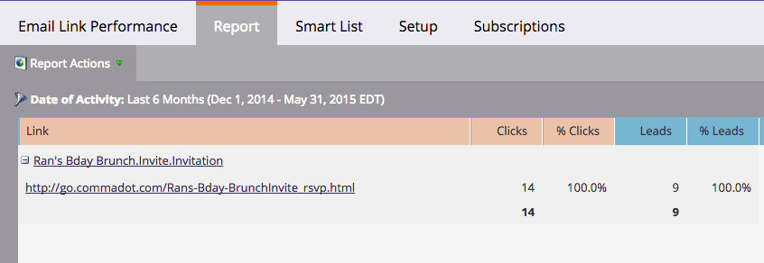

# Rapporto prestazioni collegamento e-mail {#email-link-performance-report}

Crea un rapporto sulle prestazioni dei collegamenti e-mail per verificare le prestazioni dei collegamenti nelle e-mail.

1. [Crea un report in un programma](/help/marketo/product-docs/reporting/basic-reporting/creating-reports/create-a-report-in-a-program.md) e seleziona **Prestazioni collegamento e-mail** come tipo di report.

   

1. Fare clic su **Configurazione**.

   

1. Fai doppio clic su **Data attività** in **Impostazioni**.

   

1. Imposta un intervallo di tempo appropriato per il rapporto. Fai clic su **Salva**.

   

1. Fai clic su **Report**.

   

1. Fantastico! Ora hai creato un rapporto sulle prestazioni dei collegamenti e-mail.

   

[Le colonne disponibili](/help/marketo/product-docs/reporting/basic-reporting/editing-reports/select-report-columns.md) per un report delle prestazioni di un collegamento e-mail includono:

<table> 
 <thead> 
  <tr> 
   <th colspan="1" rowspan="1">Colonna</th> 
   <th colspan="1" rowspan="1">Descrizione</th> 
  </tr> 
 </thead> 
 <tbody> 
  <tr> 
   <td colspan="1" rowspan="1">Collegamento</td> 
   <td colspan="1" rowspan="1">Raggruppato per nome e-mail. Fare clic sul segno più (+) per visualizzare tutti i collegamenti inclusi nell'e-mail.</td> 
  </tr> 
  <tr> 
   <td colspan="1" rowspan="1">Clic</td> 
   <td colspan="1" rowspan="1">Il numero di volte in cui è stato fatto clic sul collegamento.</td> 
  </tr> 
  <tr> 
   <td colspan="1" rowspan="1">% clic</td> 
   <td colspan="1" rowspan="1">Percentuale del totale dei clic su tutti i collegamenti nell’e-mail in questione sul collegamento.</td> 
  </tr> 
  <tr> 
   <td colspan="1" rowspan="1">Persone</td> 
   <td colspan="1" rowspan="1">Il numero di persone univoche che hanno fatto clic sul collegamento.</td> 
  </tr> 
  <tr> 
   <td colspan="1" rowspan="1">% persone</td> 
   <td colspan="1" rowspan="1">Percentuale del totale di persone univoche che hanno fatto clic sui collegamenti in quell’e-mail su questo collegamento.</td> 
  </tr> 
 </tbody> 
</table>

>[!NOTE]
>
>Questo report mostra il &quot;collegamento non valido&quot; quando si aggiungono collegamenti non validi o vuoti a un’e-mail. Se viene visualizzato questo messaggio, [verifica la presenza di collegamenti o token vuoti nell&#39;origine HTML](/help/marketo/product-docs/email-marketing/general/functions-in-the-editor/edit-an-emails-html.md) nell&#39;editor e-mail che non popolano un collegamento completo.

>[!TIP]
>
>Se desideri sapere esattamente cosa ha fatto una singola persona, puoi aprire il [Registro attività](/help/marketo/product-docs/core-marketo-concepts/smart-lists-and-static-lists/managing-people-in-smart-lists/filter-activity-types-in-the-activity-log-of-a-person.md) nella pagina [Dettagli persona](/help/marketo/product-docs/core-marketo-concepts/smart-lists-and-static-lists/managing-people-in-smart-lists/using-the-person-detail-page.md) dalla scheda Membri nel programma.

>[!MORELIKETHIS]
>
>* [Rapporto prestazioni e-mail](/help/marketo/product-docs/email-marketing/email-programs/email-program-data/email-performance-report.md)
>* [Filtrare Assets in un report e-mail](/help/marketo/product-docs/reporting/basic-reporting/report-activity/filter-assets-in-an-email-report.md)
