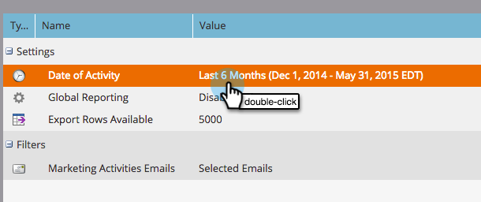

# Rapporto sulle prestazioni dei collegamenti e-mail {#email-link-performance-report}

Crea un rapporto sulle prestazioni dei collegamenti e-mail per vedere le prestazioni dei collegamenti presenti nelle e-mail.

1. [Creare un rapporto in un programma](/help/marketo/product-docs/reporting/basic-reporting/creating-reports/create-a-report-in-a-program.md) e seleziona **Prestazioni collegamento e-mail** come tipo di report.

   

1. Fai clic su **Configurazione**.

   

1. Fai doppio clic su **Data dell’attività** sotto **Impostazioni**.

   

1. Imposta un intervallo di tempo appropriato per il rapporto. Fai clic su **Salva**.

   

1. Fai clic su **Rapporto**.

   

1. Fantastico! Ora hai creato un rapporto sulle prestazioni dei collegamenti e-mail.

   

[Colonne disponibili](/help/marketo/product-docs/reporting/basic-reporting/editing-reports/select-report-columns.md) per un rapporto sulle prestazioni dei collegamenti e-mail:

<table> 
 <thead> 
  <tr> 
   <th colspan="1" rowspan="1">Colonna</th> 
   <th colspan="1" rowspan="1">Descrizione</th> 
  </tr> 
 </thead> 
 <tbody> 
  <tr> 
   <td colspan="1" rowspan="1">Collegamento</td> 
   <td colspan="1" rowspan="1">Raggruppato per nome e-mail. Fai clic sul segno più (+) per visualizzare tutti i collegamenti inclusi nell’e-mail.</td> 
  </tr> 
  <tr> 
   <td colspan="1" rowspan="1">Clic</td> 
   <td colspan="1" rowspan="1">Numero di volte in cui è stato fatto clic sul collegamento.</td> 
  </tr> 
  <tr> 
   <td colspan="1" rowspan="1">% clic</td> 
   <td colspan="1" rowspan="1">Percentuale su questo collegamento del totale clic su tutti i collegamenti presenti nell’e-mail.</td> 
  </tr> 
  <tr> 
   <td colspan="1" rowspan="1">Persone</td> 
   <td colspan="1" rowspan="1">Numero di persone univoche che che hanno fatto clic sul collegamento.</td> 
  </tr> 
  <tr> 
   <td colspan="1" rowspan="1">% Persone</td> 
   <td colspan="1" rowspan="1">Percentuale del totale di persone univoche che hanno fatto clic sui collegamenti in quell'e-mail, su questo collegamento.</td> 
  </tr> 
 </tbody> 
</table>

>[!NOTE]
>
>Questo report mostrerà &quot;link non valido&quot; quando si aggiungono collegamenti non validi/vuoti a un&#39;e-mail. Se visualizzi questo messaggio, [controllare l&#39;origine HTML](/help/marketo/product-docs/email-marketing/general/functions-in-the-editor/edit-an-emails-html.md) nell’editor e-mail per collegamenti vuoti o token che non compilano un collegamento completo.

>[!TIP]
>
>Se vuoi sapere esattamente cosa ha fatto una persona, puoi aprire il [Registro attività](/help/marketo/product-docs/core-marketo-concepts/smart-lists-and-static-lists/managing-people-in-smart-lists/filter-activity-types-in-the-activity-log-of-a-person.md) in [Dettagli persona](/help/marketo/product-docs/core-marketo-concepts/smart-lists-and-static-lists/managing-people-in-smart-lists/using-the-person-detail-page.md) dalla scheda Membri del programma.

>[!MORELIKETHIS]
>
>* [Rapporto prestazioni e-mail](/help/marketo/product-docs/email-marketing/email-programs/email-program-data/email-performance-report.md)
>* [Filtrare le risorse in un rapporto e-mail](/help/marketo/product-docs/reporting/basic-reporting/report-activity/filter-assets-in-an-email-report.md)

