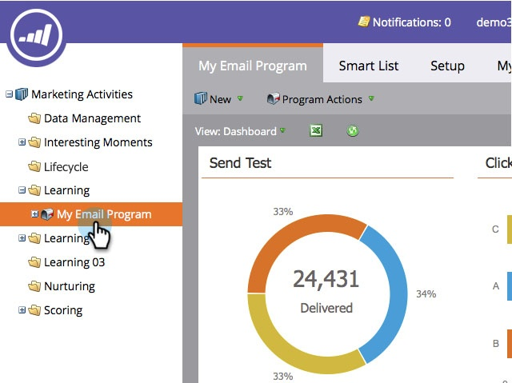

# Esportare la dashboard del programma e-mail in Excel {#export-email-program-dashboard-to-excel}

Dopo aver eseguito un programma e-mail e aver inserito alcuni dati nel dashboard, puoi esportarli in excel per ulteriori analisi. Ecco come.

1. Passa a **[!UICONTROL Marketing Activities]**.

   

1. Trova e seleziona il programma e-mail.

   

   >[!NOTE]
   >
   >Se il programma e-mail non è ancora stato avviato, non verrà visualizzata una dashboard perché non sono presenti dati da visualizzare.

1. Fai clic sull’icona di Excel per avviare l’esportazione.

   

   Abbastanza facile, vero?
