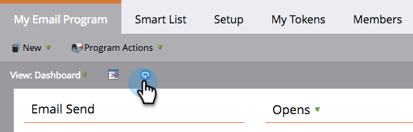

# Utilizzare il dashboard del programma e-mail {#use-the-email-program-dashboard}

Scopri le prestazioni dei programmi e-mail con questa vista del dashboard.

>[!NOTE]
>
>Se il programma dispone di un test A/B, controlla il [Dashboard del programma e-mail - Visualizzazione test A/B](/help/marketo/product-docs/email-marketing/email-programs/email-program-actions/email-test-a-b-test/use-the-email-program-dashboard-a-b-test-view.md).

>[!NOTE]
>
>Tutti i dati in questa visualizzazione sono aggregati (include il test A/B e l’invio finale dell’e-mail).

## Invia e-mail {#email-send}

Qui puoi vedere quante e-mail sono state inviate, rimbalzate e consegnate.

>[!NOTE]
>
>A causa degli standard di recapito messaggi e-mail non controllati da Marketo, le statistiche rimbalzate e consegnate sono approssimative, non esatte.

## Aperture/Clic {#opens-clicks}

Questo grafico mostra il numero di e-mail aperte o su cui hai fatto clic durante specifici periodi di tempo dopo l’esecuzione del programma e-mail.

>[!TIP]
>
>Tieni presente che il numero di aperture/clic diminuisce man mano che il tempo passa.

## Riepilogo - Coinvolgimento {#summary-engagement}

Questo mostra il totale [punteggio di coinvolgimento](/help/marketo/product-docs/email-marketing/drip-nurturing/reports-and-notifications/understanding-the-engagement-score.md).

## Riepilogo - Resto {#summary-rest}

Il resto dei dati visualizzerà Aperture, Clic, Rapporto clic/apertura e Annulla sottoscrizione.

>[!TIP]
>
>La **Annulla sottoscrizione** nell&#39;esempio precedente il tasso era così basso che Marketo ha ingrandito per darvi un aspetto migliore. Il secondo numero all&#39;interno della barra viene semplicemente aggiunto per la scala.

>[!NOTE]
>
>**Definizione**
>
>**Aperture** sono conteggiati quando il destinatario e-mail scarica le immagini dell’e-mail, che include un pixel di tracciamento inserito da Marketo. Se il destinatario visualizza l’e-mail ma sceglie di non scaricare le immagini, questa non verrà conteggiata come aperta. Se le immagini vengono caricate nel riquadro di anteprima del destinatario, in genere vengono conteggiate come aperte, ma variano in base al client e-mail.
>
>**Fare clic per aprire** misura la percentuale di e-mail aperte con un collegamento selezionato nell’e-mail. Prendiamo il numero di clic unici diviso per il numero di aperture univoche, poi moltiplichiamo per 100 per mostrarlo come percentuale.

## Aggiorna dashboard {#refresh-dashboard}

Per visualizzare i dati più aggiornati, fai clic sull’icona di aggiornamento nel dashboard.

>[!MORELIKETHIS]
>
>[Utilizzare la dashboard del programma e-mail - Visualizzazione test A/B](/help/marketo/product-docs/email-marketing/email-programs/email-program-actions/email-test-a-b-test/use-the-email-program-dashboard-a-b-test-view.md)
