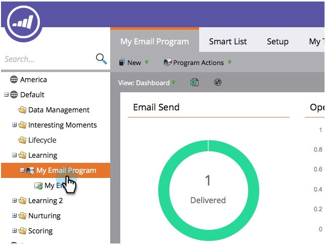

# Visualizzare i risultati del programma e-mail {#view-email-program-results}

Proprio come la scheda [!UICONTROL Results] nelle campagne intelligenti, è possibile visualizzare le stesse informazioni nei programmi e-mail.

1. Passa a **[!UICONTROL Marketing Activities]**.

   

1. Trova e seleziona il programma e-mail.

   

   >[!NOTE]
   >
   >Se il programma e-mail è già stato eseguito, verrà visualizzata direttamente la dashboard del programma e-mail.

1. In **[!UICONTROL View]**, selezionare **[!UICONTROL Control Panel]**.

   

1. Nel riquadro **[!UICONTROL Audience]** fare clic su **[!UICONTROL View Results]**.

   

   Eccolo!

   
