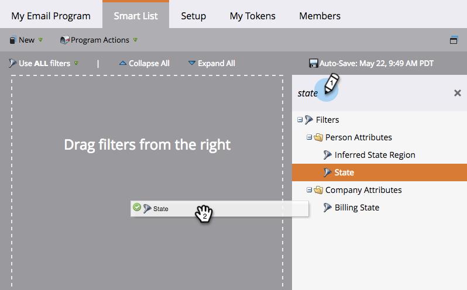

# Definire un pubblico con un elenco avanzato {#define-an-audience-with-a-smart-list}

Una volta [creare un programma e-mail](/help/marketo/product-docs/email-marketing/email-programs/creating-an-email-program/create-an-email-program.md), gli verrà indicato a chi inviare l’e-mail. Per eseguire questa operazione: [importazione di un elenco di persone](/help/marketo/product-docs/email-marketing/email-programs/managing-people-in-email-programs/define-an-audience-by-importing-a-list.md) o con un elenco avanzato. Ecco come eseguire questa operazione con un elenco avanzato.

>[!PREREQUISITES]
>
>[Creare un programma e-mail](/help/marketo/product-docs/email-marketing/email-programs/creating-an-email-program/create-an-email-program.md)

>[!NOTE]
>
>La definizione del pubblico funziona solo quando il programma e-mail non viene approvato.

1. Vai a **Attività di marketing**.

   

1. Seleziona il programma e-mail e fai clic su **Modifica elenco avanzato** sotto **Pubblico** affiancare.

   

   >[!TIP]
   >
   >Assicurarsi che la visualizzazione sia impostata su **Pannello di controllo Campaign** per trovare questa impostazione.

1. Individua i filtri che desideri utilizzare e trascinali nell’area di lavoro.

   

1. Definisci i filtri.

   

1. Al termine dell’aggiunta e della definizione dei filtri, torna alla scheda del programma principale. Vedrai quante persone si qualificano.

   

   Ottimo lavoro! Ora è il momento di [scegli un’e-mail esistente](/help/marketo/product-docs/email-marketing/email-programs/email-program-actions/choose-an-existing-email.md) o [creare un messaggio e-mail](/help/marketo/product-docs/email-marketing/email-programs/email-program-actions/create-an-email-for-an-email-program.md) per inviare messaggi a queste persone.

>[!NOTE]
>
>**Definizione**
>
>Hai notato il numero Bloccato? Questo numero è un sottoinsieme delle persone che si sono qualificate e rappresenta le persone alle quali non è possibile inviare questa e-mail perché sono:
>
>* Annulla l&#39;iscrizione
>* Marketing sospeso
>* Inserire nell&#39;elenco Bloccati
>* E-mail non valida
>* E-mail vuota
>
>Fare clic sul numero per visualizzare un elenco dettagliato delle persone bloccate dalla posta. **Nota:** Le e-mail operative verranno comunque inviate a persone contrassegnate come non abbonate e il marketing verrà sospeso.
>
>Utilizza il  per vedere quante persone riceveranno l’e-mail.

>[!MORELIKETHIS]
>
>* [Scegli un messaggio e-mail esistente](/help/marketo/product-docs/email-marketing/email-programs/email-program-actions/choose-an-existing-email.md)
>* [Creare un messaggio e-mail per un programma e-mail](/help/marketo/product-docs/email-marketing/email-programs/email-program-actions/create-an-email-for-an-email-program.md)
