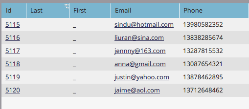

# Importare un elenco di caratteri non latini {#import-a-non-latin-characters-list}

Stai cercando di importare un file che non è in inglese? L&#39;elenco appare perfetto quando lo si apre con Excel.

Ma quando lo importi in Marketo, potresti notare che i caratteri non inglesi non vengono presi correttamente.

Questo perché il file non viene salvato correttamente affinché Marketo riconosca tutti i caratteri non latini. La buona notizia è che ci sono alcuni semplici passi che puoi seguire per ripararlo.

1. Seleziona **Salva con nome...** dal **File** in Excel.

   

1. Scegli **Testo Unicode UTF-16 (.txt)** come **Formato** opzione . In questo modo il file verrà codificato come Marketo può visualizzarlo.

   

   >[!NOTE]
   >
   >Marketo supporta anche UTF-8, Shift-JIS o EUC-JP.

1. Il nuovo file verrà salvato come file di testo con estensione .txt. Ma converte anche tutte le virgole nel file in schede. Dobbiamo cambiarlo di nuovo.

   >[!TIP]
   >
   >È possibile aprire il file di testo utilizzando **Blocco note** se si utilizza Windows o **TextEdit** se utilizzi un Mac.

   

1. Selezionare una scheda dal documento e copiarla.

   

1. Seleziona **Trova e sostituisci...** dal **Modifica** menu.

   

   >[!TIP]
   >
   >L&#39;azione equivalente per gli utenti Windows è: **Modifica > Sostituisci..**

1. Incolla la scheda copiata al punto 4 nella prima casella (da sostituire) e digita una virgola nella seconda casella (sostituisci con). E fai clic su **Tutto**.

   

1. E voila, tutte le virgole sono tornate e siamo pronti a partire.

   

1. Importa il nuovo file in Marketo e le informazioni devono essere visualizzate correttamente questa volta.

   

   >[!NOTE]
   >
   >Tutti i campi data/ora da importare vengono trattati come Ora centrale. Se si dispone di campi data/ora in un fuso orario diverso, è possibile utilizzare una formula Excel per trasformarla in Ora centrale (America/Chicago).

Sappiamo che è strano, ma funziona. Felice importazione!
