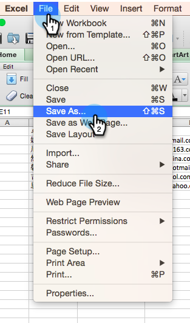

# Importa un elenco di caratteri non latini {#import-a-non-latin-characters-list}

Stai tentando di importare un file non in inglese? L&#39;elenco è perfetto quando viene aperto con Excel.

Ma quando lo importate in Marketo, potreste vedere che i caratteri non inglesi non vengono presi correttamente.

Questo perché il file non viene salvato correttamente affinché Marketo riconosca tutti i caratteri non latini. La buona notizia è che ci sono alcuni semplici passi da seguire per ripararlo.

1. Selezionare **Salva con nome...** dal menu **File** in Excel.

   

1. Scegliete **UTF-16 Unicode Text (.txt)** come opzione **Format**. Questo codificherà il file nel modo in cui Marketo può visualizzarlo.

   

   >[!NOTE]
   >
   >Marketo supporta anche UTF-8, Shift-JIS o EUC-JP.

1. Il nuovo file verrà salvato come file di testo con estensione .txt. Ma converte anche tutte le virgole nel file in schede. Dobbiamo rimetterlo in sesto.

   >[!TIP]
   >
   >È possibile aprire il file di testo utilizzando **Blocco note** se si utilizza Windows o **TextEdit** se si utilizza Mac.

   

1. Selezionare una scheda dal documento e copiarla.

   

1. Selezionare **Trova e sostituisci...** dal menu **Modifica**.

   

   >[!TIP]
   >
   >L&#39;azione equivalente per gli utenti Windows è: **Modifica > Sostituisci...**

1. Incollare la scheda copiata al punto 4 nella prima casella (da sostituire) e digitare una virgola nella seconda casella (sostituire con). Fare clic su **All**.

   

1. E voilà, tutte le virgole sono tornate e siamo pronti a partire.

   

1. Importa il nuovo file in Marketo, e le informazioni devono essere visualizzate correttamente questa volta.

   

   >[!NOTE]
   >
   >Tutti i campi data/ora importati vengono considerati come Ora centrale. Se i campi data/ora si trovano in un fuso orario diverso, è possibile utilizzare una formula Excel per trasformarla in Ora centrale (America/Chicago).

Sappiamo che questo è strano, ma funziona. Felice Importare!
