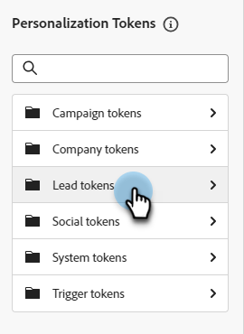
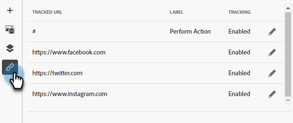

# Modelli e-mail {#email-templates}

Per un processo di progettazione accelerato e migliorato, puoi creare modelli e-mail autonomi per riutilizzare facilmente i contenuti personalizzati.

>[!IMPORTANT]
>
>Questo articolo è solo per i membri del Nuovo Marketo Engage E-mail Designer beta. Non divulgare.

>[!NOTE]
>
>I modelli e-mail nel nuovo e-mail designer possono essere utilizzati solo per creare e-mail nel nuovo e-mail designer. Non è possibile farvi riferimento nel vecchio editor e-mail.

## Creare un modello e-mail {#create-an-email-template}

1. Accedi al Marketo Engage tramite [Adobe Experience Cloud](https://experiencecloud.adobe.com/){target="_blank"}.

1. In Il mio Marketo, seleziona **Design Studio**.

   

1. Nella struttura selezionare **Modelli di posta elettronica (nuovo editor)**.

   

1. Fare clic sul pulsante **Crea modello**.

   

1. Immettere un nome di modello e una descrizione facoltativa. Fai clic su **Crea**.

   

## Progettare il modello {#design-your-template}

Nella pagina _Progetta modello_ puoi scegliere tra alcune opzioni. [Progetta da zero](#design-from-scratch), [importa il tuo HTML personale](#import-html) o [seleziona un modello esistente](#choose-a-template) (uno dei nostri esempi o uno già salvato).


### Creare da zero {#design-from-scratch}

Definisci il contenuto aggiungendo e spostando elementi strutturali con semplici azioni di trascinamento della selezione.

1. Nella pagina _Progetta modello_, seleziona **Progetta da zero**.

1. Aggiungi [struttura e contenuto](#add-structure-and-content).

### Importa il tuo HTML {#import-your-html}

Puoi importare contenuti HTML esistenti per progettare i modelli e-mail. Il contenuto può essere:

* Un file HTML con un foglio di stile incorporato

* Un file .zip che include un file HTML, il foglio di stile (.css) e le immagini

>[!NOTE]
>
>La struttura del file .zip non è soggetta a vincoli. Tuttavia, i riferimenti devono essere relativi e adattarsi alla struttura ad albero della cartella .zip.

1. Nella pagina _Progetta modello_, seleziona **Importa HTML**.

1. Trascina e rilascia il file HTML o .zip desiderato (o seleziona un file dal computer) e fai clic su **Importa**.

   

   >[!NOTE]
   >
   >Quando il contenuto di HTML viene caricato, il contenuto sarà in modalità di compatibilità. In questa modalità, puoi solo personalizzare il testo, aggiungere collegamenti o aggiungere risorse al contenuto.

1. Per poter sfruttare i componenti di contenuto di E-mail Designer, fai clic sulla scheda **Convertitore HTML** e fai clic su **Converti**.

   SCHERMATA

   >[!CAUTION]
   >
   >L&#39;utilizzo di un tag `<table>` come primo livello in un file HTML può causare la perdita di stile, incluse le impostazioni di sfondo e larghezza nel tag del livello superiore.

Ora puoi personalizzare il file importato in base alle esigenze con l’editor e-mail visivo.

### Scegli un modello {#choose-a-template}

È possibile scegliere tra due tipi di modelli.

* **Modelli di esempio**: il Marketo Engage offre quattro modelli di e-mail predefiniti.

* **Modelli salvati**: si tratta di modelli creati da zero utilizzando il menu Modelli o di un messaggio di posta elettronica creato e scelto di salvare come modello.

>[!BEGINTABS]

>[!TAB Modelli di esempio]

Scegli uno dei modelli predefiniti per iniziare subito a progettare modelli e-mail.

1. La scheda Modelli di esempio è aperta per impostazione predefinita.

1. Seleziona il modello da utilizzare.

   

1. Fare clic su **Usa questo modello**.

   

1. Modifica il contenuto come desiderato utilizzando la finestra di progettazione del contenuto visivo.

>[!TAB Modelli salvati]

1. Fai clic sulla scheda **Modelli salvati** e seleziona il modello desiderato.

   

1. Fare clic su **Usa questo modello**.

   

1. Modifica il contenuto come desiderato utilizzando la finestra di progettazione del contenuto visivo.

>[!ENDTABS]

## Aggiungere struttura e contenuto {#add-structure-and-content}

1. Per iniziare a creare o modificare il contenuto, trascina un elemento da Strutture nell’area di lavoro. Modificane le impostazioni nel riquadro a destra.

   >[!TIP]
   >
   >Seleziona il componente colonna n:n per definire il numero di colonne desiderato (tra tre e 10). Puoi anche definire la larghezza di ciascuna colonna spostando le frecce sotto di essa.

   

   >[!NOTE]
   >
   >Le dimensioni di ogni colonna non possono essere inferiori al 10% della larghezza totale del componente struttura. È possibile rimuovere solo colonne vuote.

1. Dalla sezione Sommario, trascina gli elementi desiderati e rilasciali in uno o più componenti della struttura.

   

1. Ogni componente può essere personalizzato tramite le schede Impostazioni o Stile. Modificare il carattere, lo stile del testo, il margine e altro ancora.

### Aggiungi Assets {#add-assets}

```
ADD ASSETS OR ADD IMAGES? WHAT OTHER ASSETS CAN YOU ADD??
```

```
Access assets stored in the Assets library. IMAGES AND FILES ONLY? - SEE EMAIL AUTHORING FOR ANSWERS - KG
```

1. Per accedere alle immagini, fai clic sull’icona del selettore delle risorse.

   SCHERMATA

1. Trascina e rilascia l’immagine desiderata in un componente struttura.

   SCHERMATA

   >[!NOTE]
   >
   >Per sostituire un&#39;immagine esistente, selezionala, quindi fai clic su **Seleziona una risorsa** nella scheda Impostazioni a destra.

Fai clic su Abilita contenuto condizione per aggiungere contenuto dinamico e adattare il contenuto ai profili target in base a regole condizionali.


Se necessario, puoi personalizzare ulteriormente l’e-mail facendo clic su Passa all’editor di codice dal menu avanzato. Questo consente di modificare il codice sorgente dell’e-mail, ad esempio per aggiungere tag di tracciamento o HTML personalizzati.

ATTENZIONE
Dopo il passaggio all’editor di codice, non puoi tornare al designer visivo per questo messaggio e-mail.

Una volta che il contenuto è pronto, fai clic sul pulsante Simula contenuto per verificare il rendering. È possibile scegliere la visualizzazione desktop o mobile.

Al termine, fai clic su Salva.

### Livelli, impostazioni e stili {#layers-settings-styles}

Apri la struttura di navigazione per accedere a strutture specifiche e alle relative colonne/componenti per una modifica più granulare. Per accedere a, fai clic sull’icona della struttura di navigazione.


L’esempio seguente illustra i passaggi per regolare la spaziatura e l’allineamento verticale all’interno di un componente struttura composto da colonne.

1. Selezionare la colonna nel componente struttura direttamente nell&#39;area di lavoro o utilizzando la _struttura di spostamento_ visualizzata a sinistra.

1. Dalla barra degli strumenti della colonna, fare clic sullo strumento _[!UICONTROL Seleziona una colonna]_ e scegliere quello che si desidera modificare.

   Puoi anche selezionarla dall’albero della struttura. I parametri modificabili per tale colonna vengono visualizzati nelle schede _[!UICONTROL Impostazioni]_ e _[!UICONTROL Stili]_ a destra.

   

1. Per modificare le proprietà della colonna, fai clic sulla scheda _[!UICONTROL Stili]_ a destra e modificale in base alle tue esigenze:

   * Per **[!UICONTROL Sfondo]**, modifica il colore di sfondo in base alle esigenze.

     Deselezionare la casella di controllo relativa a uno sfondo trasparente. Abilita l&#39;impostazione **[!UICONTROL Immagine di sfondo]** per utilizzare un&#39;immagine come sfondo invece di un colore a tinta unita.

   * Per **[!UICONTROL Allineamento]**, seleziona l&#39;icona _Superiore_, _Centro_ o _Inferiore_.
   * Per **[!UICONTROL Spaziatura interna]**, definire la spaziatura per tutti i lati.

     Selezionare **[!UICONTROL Spaziatura interna diversa per ogni lato]** se si desidera modificarla. Fai clic sull&#39;icona _Blocca_ per interrompere la sincronizzazione.

   * Espandi la sezione **[!UICONTROL Avanzate]** per definire gli stili in linea per la colonna.

   

1. Ripeti questi passaggi per regolare l’allineamento e la spaziatura per le altre colonne del componente.

1. Salva le modifiche.

### Personalizzare il contenuto {#personalize-content}

I token funzionano nel nuovo editor nello stesso modo in cui funzionano nel vecchio, ma l’icona ha un aspetto diverso. L’esempio seguente illustra l’aggiunta di un token di nome con testo di fallback.

1. Seleziona il componente testo. Posiziona il cursore nel punto in cui desideri visualizzare il token e fai clic sull&#39;icona **Aggiungi personalizzazione**.

   

1. Fai clic sul tipo di [token](/help/marketo/product-docs/demand-generation/landing-pages/personalizing-landing-pages/tokens-overview.md){target="_blank"} desiderato.

   

1. Trova il token desiderato e fai clic sull&#39;icona **...** (facendo clic sull&#39;icona + viene aggiunto un token senza testo di fallback).

   

   >[!NOTE]
   >
   >&quot;Testo di fallback&quot; è il nuovo termine dell’editor per il valore predefinito. Esempio: ``{{lead.First Name:default=Friend}}``. È consigliato nel caso in cui non vi sia alcun valore per la persona nel campo scelto.

1. Imposta il testo di fallback e fai clic su **Aggiungi**.

   

1. Fai clic su **Salva**.

### Modifica tracciamento URL {#edit-url-tracking}

A volte è meglio non abilitare l’URL di tracciamento di Marketo su un collegamento all’interno di un’e-mail. Questa funzione è utile quando la pagina di destinazione non supporta i parametri URL e può causare il mancato funzionamento del collegamento.

1. Fai clic sull’icona Collegamenti per visualizzare tutti gli URL nel messaggio e-mail.

   

1. Fai clic sull’icona a forma di matita per modificare il tracciamento di eventuali collegamenti desiderati.

1. Fai clic sul menu a discesa **Tipo di tracciamento** ed effettua la selezione.

   

   <table><tbody>
     <tr>
       <td><b>Traccia senza markt_tok</b></td>
       <td>Attiva il tracciamento sull’URL senza utilizzare il parametro della stringa di query mkt_tok nell’URL di destinazione</td>
     </tr>
     <tr>
       <td><b>Traccia con mkt_tok</b></td>
       <td>Attiva il tracciamento sull’URL utilizzando il parametro della stringa di query mkt_tok nell’URL di destinazione</td>
     </tr>
     <tr>
       <td><b>Non tracciare</b></td>
       <td>Disattiva il tracciamento dell’URL</td>
     </tr>
   </tbody>
   </table>

1. Facoltativamente, puoi assegnare all’URL un’etichetta o aggiungere Tag.

1. Al termine, fai clic su **Salva**.

### Opzioni di visualizzazione {#view-options}

Sfrutta le opzioni di convalida di visualizzazione e contenuto disponibili nell’editor e-mail visivo.

* Effettua lo zoom avanti/indietro sul contenuto utilizzando le opzioni di zoom predefinite.

* Visualizza il contenuto in Desktop, Dispositivi mobili o Solo testo/Testo normale.

   * Fai clic sull’icona della visualizzazione live (occhio) per l’anteprima del contenuto tra i dispositivi.

   * Seleziona uno dei dispositivi predefiniti o immetti dimensioni personalizzate per visualizzare in anteprima il contenuto.

### Altre opzioni {#more-options}

Dalle opzioni **Altro** nell&#39;editor dei contenuti, puoi eseguire le azioni seguenti:

SCHERMATA

* **Reimposta modello**: selezionare questa opzione per cancellare l&#39;area di lavoro di progettazione e-mail visiva in un&#39;area di lavoro vuota e riavviare la creazione del contenuto.

* **Modifica la progettazione**: torna alla pagina _Progetta modello_. Da qui puoi intraprendere qualsiasi azione come descritto nella sezione [Progettare il modello](#design-your-template).

* **Esporta HTML**: scarica il contenuto nell&#39;area di lavoro visiva nel sistema locale in formato HTML compresso come file zip.

## Visualizza dettagli modello {#view-template-details}

Nella pagina dell&#39;elenco _Modelli e-mail_, fai clic sul nome di un modello e-mail per visualizzarne i dettagli.

SCHERMATA

È possibile modificare dettagli di base come nome e descrizione. Fare clic all&#39;esterno del campo modificato per salvare le modifiche.

Fai clic su **Altro** per eliminare o duplicare rapidamente il modello.

Se sono presenti avvisi attivi (errori/avvisi per il modello e-mail), fai clic su Avvisi per visualizzare le informazioni.

>[!NOTE]
>
>Anche se questi avvisi non vietano l’utilizzo del modello e-mail per la creazione di e-mail, forniscono visibilità su ciò che potrebbe non funzionare e sugli aggiornamenti necessari prima che l’e-mail possa essere utilizzata per la consegna.

## Visualizza modello e-mail utilizzato da riferimenti {#email-template-used-by-references}

Nel riepilogo del modello e-mail, fai clic sulla scheda **Usato da** per visualizzare i dettagli di dove è stato utilizzato questo modello e-mail nel Marketo Engage.

SCHERMATA

## Modifica modelli e-mail {#edit-email-templates}

Questa azione può essere intrapresa da:

* Scheda dei dettagli - Fare clic su **Modifica modello e-mail**.

* Pagina di elenco dei _modelli e-mail_: fai clic sull&#39;icona Altre azioni (tre punti) del modello e-mail desiderato e scegli Modifica.

```
THE SECOND ONE DOESN'T WORK IN MARKETO?? JUST LISTS DUPE AND DELETE - CONFIRMED WITH NILESH - KG
```

Questa azione ti porta alla pagina _Progetta il modello_ o alla pagina dell&#39;editor di contenuti visivi in base all&#39;ultimo stato salvato del modello e-mail. Da qui puoi modificare il contenuto del modello e-mail in base alle esigenze. Consulta Creare modelli e-mail per informazioni sulle opzioni di modifica.

## Modelli e-mail duplicati {#duplicate-email-templates}

Esistono due modi per duplicare un modello e-mail:

* Dai dettagli del modello e-mail a destra, fai clic su **Altro** e seleziona **Duplica**.

SCHERMATA

* Nella pagina di elenco dei _modelli e-mail_, fai clic sull&#39;icona Altre azioni (tre punti) del modello e-mail desiderato e scegli **Duplica**.

Nella finestra di dialogo, inserisci un nome univoco e una descrizione facoltativa. Al termine, fai clic su **Duplica**.

Il modello e-mail duplicato viene quindi visualizzato nella pagina di elenco _Modelli e-mail_.

## Elimina modelli e-mail {#delete-email-templates}

Esistono due modi per eliminare un modello e-mail.

>[!CAUTION]
>
>L’eliminazione di un modello e-mail non può essere annullata.

* Dai dettagli del modello e-mail a destra, fai clic su **Altro** e seleziona **Elimina**.

SCHERMATA

* Nella pagina dell&#39;elenco _Modelli e-mail_, fai clic sull&#39;icona Altre azioni (tre punti) del modello e-mail desiderato e scegli **Elimina**.

## Azioni in blocco {#bulk-actions}

Dalla pagina di elenco dei _modelli e-mail_, seleziona più modelli selezionando le caselle di controllo a sinistra. Nella parte inferiore viene visualizzato un banner.

**Elimina**: è possibile eliminare un massimo di 20 modelli alla volta. Una finestra di dialogo di conferma ti consente di interrompere l’azione o confermare l’eliminazione.

>[!MORELIKETHIS]
>
>[Authoring di e-mail](/help/marketo/product-docs/email-marketing/general/beta-new-email-designer/email-authoring.md){target="_blank"}: scopri come creare, progettare e fare riferimento a un messaggio e-mail nella nuova finestra di progettazione.
