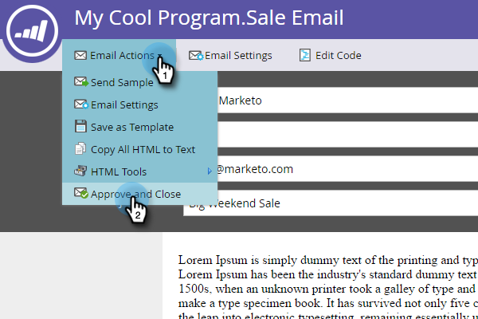

# Approvare un’e-mail {#approve-an-email}

Le e-mail iniziano in stato di bozza. In genere non sono disponibili nel sistema fino a quando non vengono approvati. Esistono alcuni modi per approvare un’e-mail.

## Approva tramite il menu [!UICONTROL Email Actions] {#approve-it-using-the-email-actions-menu}

1. Trovare e selezionare l&#39;e-mail, fare clic sul menu a discesa **[!UICONTROL Email Actions]** e selezionare **[!UICONTROL Approve]**.

   

## Approva direttamente nella struttura {#approve-it-directly-in-the-tree}

1. Trovare e selezionare l&#39;e-mail, fare clic con il pulsante destro del mouse su di essa e selezionare **[!UICONTROL Approve]**.

   

## Approvare l’e-mail nell’editor e-mail {#approve-your-email-in-the-email-editor}

1. Nell&#39;e-mail, fai clic sul menu a discesa **[!UICONTROL Email Actions]** e seleziona **[!UICONTROL Approve and Close]**.

   

Dopo l’approvazione, l’e-mail è pronta per l’uso.
