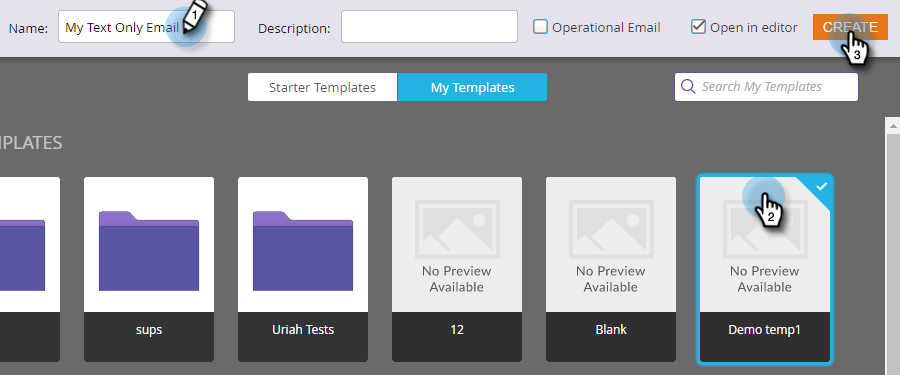

# Crea un messaggio e-mail solo testo {#create-a-text-only-email}

Se desideri inviare solo e-mail di testo, ecco come creare un’e-mail che verrà inviata senza alcun contenuto HTML.

>[!NOTE]
>
>Poiché le aperture sono tracciate dal destinatario che scarica le immagini dell’e-mail (che include un pixel di tracciamento invisibile), le aperture sono **not** può essere tracciato per le e-mail solo testo.

1. Vai a **Attività di marketing** area.

   

1. Seleziona il programma e fai clic sul pulsante **Nuovo** a discesa e seleziona **Nuova risorsa locale**.

   

1. Seleziona **E-mail**.

   

1. Inserisci un **Nome**, seleziona un modello e fai clic su **Crea**.

   

1. Nell’editor e-mail, fai clic su **Impostazioni e-mail**.

   

1. Controlla **Solo testo** e fai clic su **Salva**.

   

   >[!CAUTION]
   >
   >I collegamenti non vengono tracciati automaticamente nelle e-mail di solo testo. Scopri come [Aggiungere collegamenti tracciati a un’e-mail di testo](/help/marketo/product-docs/email-marketing/general/functions-in-the-editor/add-tracked-links-to-a-text-email.md).

   >[!TIP]
   >
   >Puoi anche modificare un’e-mail esistente e modificare questa impostazione. Non dimenticate di approvare la bozza.

1. Deseleziona **Copia automatica da HTML** casella di controllo.

   

   >[!NOTE]
   >
   >Eventuali contenuti aggiunti alla sezione HTML dell’e-mail verranno ignorati al momento dell’invio.

1. Fare doppio clic sull&#39;area di testo.

   

1. Modifica il testo e fai clic su **Salva**.

   

È facile come quello.
