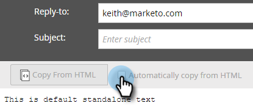

# Creare un&#39;e-mail di solo testo {#create-a-text-only-email}

Se desiderate inviare solo messaggi e-mail di testo, ecco come creare un&#39;e-mail che verrà inviata senza alcun contenuto HTML.

>[!NOTE]
>
>Poiché le aperture vengono tracciate dal destinatario che scarica le immagini del messaggio e-mail (che include un pixel di tracciamento invisibile), le aperture **non** possono essere tracciate per le e-mail Solo testo.

1. Andate all&#39;area **Attività di marketing**.

   

1. Selezionate il programma, fate clic sul menu a discesa **Nuovo** e selezionate **Nuova risorsa locale**.

   

1. Selezionare **Email**.

   

1. Immettete un **Nome**, selezionate un modello e fate clic su **Crea**.

   

1. Nell&#39;editor e-mail, fare clic su **Impostazioni e-mail**.

   

1. Selezionare **Solo testo** e fare clic su **Salva**.

   

   >[!CAUTION]
   >
   >I collegamenti non vengono tracciati automaticamente nelle e-mail di solo testo. Vedere come [aggiungere collegamenti tracciati a un&#39;e-mail di testo](/help/marketo/product-docs/email-marketing/general/functions-in-the-editor/add-tracked-links-to-a-text-email.md).

   >[!TIP]
   >
   >Potete anche modificare un’e-mail esistente e modificare questa impostazione. Non dimenticare di approvare la bozza.

1. Deselezionare la casella di controllo **Copia automatica da HTML**.

   

   >[!NOTE]
   >
   >Eventuali contenuti aggiunti alla sezione HTML dell’e-mail verranno ignorati al momento dell’invio.

1. Fare doppio clic sull&#39;area di testo.

   

1. Modificate il testo e fate clic su **Salva**.

   

È facile come quello.
