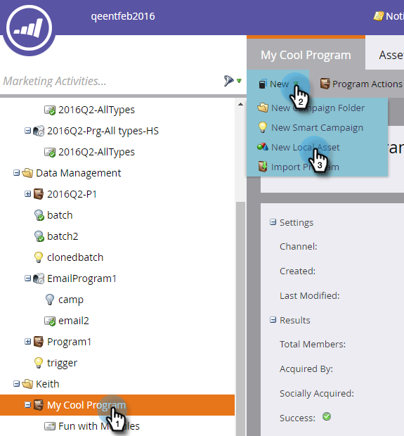

# Creare un&#39;e-mail {#create-an-email}

Esistono due modi principali per creare un’e-mail in Marketo. Guardiamo entrambi.

## Creare un&#39;e-mail in Design Studio {#create-an-email-in-the-design-studio}

1. Andate a **Design Studio**.

   

1. Fare clic sul menu a discesa **New** e selezionare **New Email**.

   

   >[!NOTE]
   >
   >Quando create un messaggio e-mail in Design Studio, questo si trova nella struttura sotto &quot;E-mail&quot;.

Semplice! Ora, al contrario...

## Creare un&#39;e-mail in attività di marketing {#create-an-email-in-marketing-activities}

1. Andate a **Marketing Activities**.

   

1. Selezionate il programma a cui desiderate aggiungere il messaggio e-mail, fate clic sul menu a discesa **New** e selezionate **New Local Asset**.

   

1. Fare clic su **E-mail**.

   

   Ed è tutto!

Il metodo scelto consente di selezionare il modello.

1. Assegna un nome all&#39;e-mail, fai clic sul modello da utilizzare, quindi fai clic su **Crea**.

   

   >[!NOTE]
   >
   >Potete scegliere tra una raccolta di modelli e-mail reattivi pronti per l&#39;uso o un modello salvato selezionando prima **My Templates** e seguendo gli stessi passaggi.

1. Immettere un oggetto. C&#39;è un contatore a destra per farti sapere se sei sotto il massimo di 50 caratteri raccomandato.

   

   A seconda del modello scelto, avrete diverse opzioni in cui modificare il messaggio e-mail. Per le e-mail con moduli, controllare [Aggiungi moduli alla posta elettronica](/help/marketo/product-docs/email-marketing/general/email-editor-2/add-modules-to-your-email.md).

L&#39;e-mail è stata creata, quindi è necessario modificarla.

>[!MORELIKETHIS]
>
>[Modifica intestazione e-mail](/help/marketo/product-docs/email-marketing/general/creating-an-email/edit-your-email-header.md)
