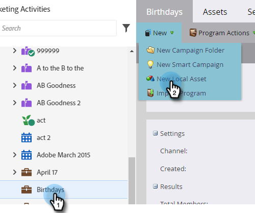

# Creare un messaggio e-mail {#create-an-email}

Esistono due modi principali per creare un’e-mail in Marketo. Guardiamo entrambi.

## Creare un messaggio e-mail in Design Studio {#create-an-email-in-the-design-studio}

1. Passare a **[!UICONTROL Design Studio]**.

   

1. Fare clic sul menu a discesa **[!UICONTROL New]** e selezionare **[!UICONTROL New Email]**.

   

   >[!NOTE]
   >
   >Quando crei un&#39;e-mail in [!UICONTROL Design Studio], si trova nella struttura in &quot;[!UICONTROL Emails]&quot;.

Semplice! Ora per il contrario...

## Creare un messaggio e-mail nelle attività di marketing {#create-an-email-in-marketing-activities}

1. Vai a **[!UICONTROL Marketing Activities]**.

   

1. Selezionare il programma a cui si desidera aggiungere l&#39;e-mail, fare clic sul menu a discesa **[!UICONTROL New]** e selezionare **[!UICONTROL New Local Asset]**.

   

1. Fai clic su **[!UICONTROL Email]**.

   

   Ed è tutto!

Il metodo scelto consente di passare al selettore di modelli.

1. Assegna un nome alla tua e-mail, fai clic sul modello che desideri utilizzare, quindi fai clic su **[!UICONTROL Create]**.

   

   >[!NOTE]
   >
   >È possibile scegliere tra una raccolta di modelli di e-mail dinamici pronti all&#39;uso o un modello salvato selezionando prima **[!UICONTROL My Templates]** e seguendo gli stessi passaggi.

1. Immettere un oggetto. Il limite di caratteri consigliato è 50.

   

   A seconda del modello scelto, sono disponibili opzioni diverse per la modifica dell’e-mail. Per le e-mail con moduli, vedi [Aggiungi moduli al tuo indirizzo e-mail](/help/marketo/product-docs/email-marketing/general/email-editor-2/add-modules-to-your-email.md).

L&#39;e-mail è stata creata, quindi puoi modificarla.

>[!MORELIKETHIS]
>
>[Modifica intestazione e-mail](/help/marketo/product-docs/email-marketing/general/creating-an-email/edit-your-email-header.md)
