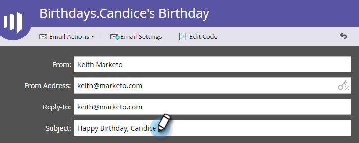

# Creare un messaggio e-mail {#create-an-email}

Esistono due modi principali per creare un’e-mail in Marketo. Guardiamo entrambi.

## Creare un messaggio e-mail in Design Studio {#create-an-email-in-the-design-studio}

1. Vai a **Design Studio**.

   

1. Fai clic sul pulsante **Nuovo** a discesa e seleziona **Nuovo messaggio e-mail**.

   

   >[!NOTE]
   >
   >Quando crei un’e-mail in Design Studio, questa si trova nella struttura in &quot;E-mail&quot;.

Semplice! Ora al contrario..

## Creare un messaggio e-mail nelle attività di marketing {#create-an-email-in-marketing-activities}

1. Vai a **Attività di marketing**.

   

1. Seleziona il programma a cui desideri aggiungere il messaggio e-mail, fai clic sul pulsante **Nuovo** a discesa e seleziona **Nuova risorsa locale**.

   

1. Fai clic su **E-mail**.

   

   Ed è tutto!

Qualsiasi metodo scelto ti porta al selettore dei modelli.

1. Assegna un nome alla tua e-mail, fai clic sul modello che desideri utilizzare, quindi fai clic su **Crea**.

   

   >[!NOTE]
   >
   >Puoi scegliere tra una raccolta di modelli e-mail reattivi pronti per l’uso o un modello salvato selezionando prima l’opzione **Modelli personali** e seguendo gli stessi passaggi.

1. Immettere un oggetto. Il limite di caratteri consigliato è 50.

   

   A seconda del modello scelto, avrai a disposizione diverse opzioni per modificare il messaggio e-mail. Per le e-mail con moduli, effettua il check-out [Aggiungi moduli all’e-mail](/help/marketo/product-docs/email-marketing/general/email-editor-2/add-modules-to-your-email.md).

L’e-mail viene ora creata, quindi puoi modificarla.

>[!MORELIKETHIS]
>
>[Modifica intestazione e-mail](/help/marketo/product-docs/email-marketing/general/creating-an-email/edit-your-email-header.md)
