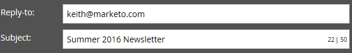

# Modifica intestazione e-mail {#edit-your-email-header}

L’intestazione e-mail in Marketo è completamente personalizzabile. Si compone di quattro campi:

* **Da** - Nome del mittente desiderato
* **Indirizzo mittente** - L&#39;indirizzo e-mail del mittente che si desidera venga visualizzato
* **Risposta** - L&#39;indirizzo e-mail a cui si desidera inviare la risposta di una persona (può essere diverso dall&#39;indirizzo Da)
* **Oggetto** - La riga dell’oggetto dell’e-mail

Per modificare questi valori, fai clic su ogni campo e immetti le tue informazioni.

>[!TIP]
>
>Per impostare un nome predefinito da e da e-mail, vedi [Modifica le etichette predefinite da e-mail e da](/help/marketo/product-docs/administration/email-setup/change-the-default-from-email-and-from-label.md).

Se desideri utilizzare un token, fai clic prima all’interno del campo desiderato, quindi fai clic sull’icona del token.

Puoi inoltre rendere il campo dinamico utilizzando i segmenti.

L’icona a forma di chiave all’estrema destra nel campo Da indirizzo consente di sapere se si utilizza una firma DKIM personalizzata.

Il contatore all’estrema destra nel campo Oggetto consente di mantenere l’oggetto al di sotto del limite di 50 caratteri consigliato.

Se si superano i 50 caratteri, il contatore diventa rosso per avvisarti.

>[!MORELIKETHIS]
>
>[Panoramica dell’editor di e-mail v2.0](/help/marketo/product-docs/email-marketing/general/email-editor-2/email-editor-v2-0-overview.md)
