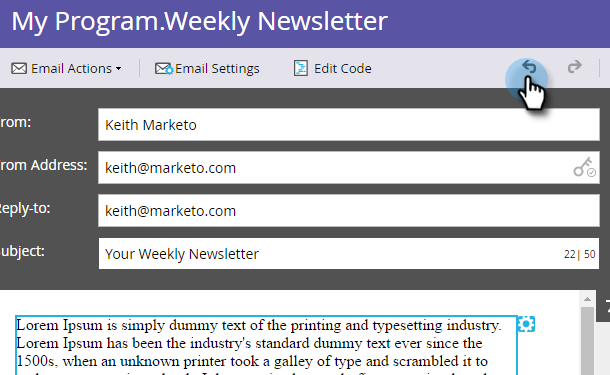

# Annullare nell’editor e-mail {#undo-in-the-email-editor}

1. Per annullare una modifica, fare clic sulla freccia a sinistra.

>[!TIP]
>
>L’annullamento può ripristinare fino a 50 modifiche.

1. Per ripristinare una modifica, fare clic sulla freccia destra.

   

   >[!NOTE]
   >
   >Impossibile annullare durante la modifica del testo. Al termine, puoi annullare tutte le modifiche dalla prima modifica per salvarle.

   Bello! Ora puoi annullare e ripristinare come un professionista.
