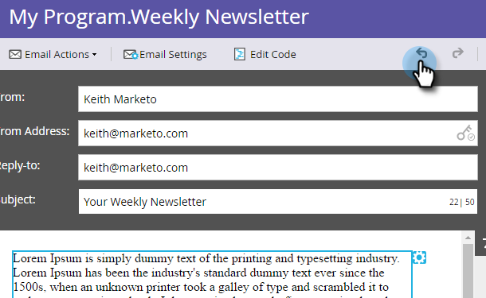

# Annulla nell’editor e-mail {#undo-in-the-email-editor}

1. Per annullare una modifica, fare clic sulla freccia Sinistra.

>[!TIP]
>
>Annulla può tornare a 50 modifiche.

1. Per ripristinare una modifica, fai clic sulla freccia Destra.

   

   >[!NOTE]
   >
   >Non è possibile annullare la modifica durante la modifica del testo. Al termine, puoi annullare tutte le modifiche dalla prima modifica al salvataggio.

   Bello! Ora è possibile annullare e ripristinare come un professionista.
