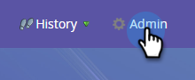

# Email CC {#email-cc}

E-mail CC consente l’invio tramite Marketo di e-mail specifiche per includere i destinatari CC.

Questa funzione è disponibile su tutte le risorse e-mail di Marketo, indipendentemente da come viene inviata l’e-mail (campagna batch o trigger). Il destinatario del CC riceverà una copia esatta dell’e-mail inviata alla persona Marketo selezionata. Di conseguenza, qualsiasi attività di coinvolgimento (aperture, clic, ecc.) verranno registrati nel registro delle attività di Marketo Person nella riga &quot;To&quot; dell’e-mail. Tuttavia, attività di consegna (inviata, consegnata, rimbalzo rigido, ecc.) _diverso da &quot;rimbalzo morbido&quot;_ sarà **not** registrati, in quanto Marketo non è in grado di distinguere gli eventi di consegna per la persona Marketo da quelli dei destinatari CC. Marketo conta solo fino a 100.000 persone alla volta. Se la tua lista intelligente supera i 100.000 e è imperativo che ogni persona su di esso abbia CC&#39;d, ti consigliamo di interrompere la tua lista.

>[!NOTE]
>
>E-mail CC non è stata progettata per essere utilizzata con i test A/B. È comunque possibile utilizzarlo se si desidera, tuttavia poiché tecnicamente non è supportato, il supporto Marketo non sarebbe in grado di fornire assistenza per eventuali problemi.

## Imposta Email CC {#set-up-email-cc}

1. In My Marketo, fai clic su **Amministratore**.

   

1. Nella struttura, seleziona **E-mail**.

   

1. Fai clic su **Modifica impostazioni di E-mail CC**.

   

1. Seleziona fino a 25 campi Marketo Lead o Company (di tipo &quot;Email&quot;) per renderli disponibili per l’uso come indirizzi CC all’interno delle e-mail. Fai clic su **Salva** al termine.

   

## Utilizzo di E-mail CC {#using-email-cc}

1. Seleziona l’e-mail e fai clic su **Modifica bozza**.

   

1. Fai clic su **Impostazioni e-mail**.

   

1. Seleziona fino a cinque campi da usare per le persone CC. In questo esempio, vogliamo solo che il proprietario lead sia autorizzato. Fai clic su **Salva** al termine.

   

   È semplice come quello! Nell’esempio precedente, quando invii l’e-mail, il proprietario principale dei destinatari scelti sarà CC-d.

   >[!NOTE]
   >
   >Se un indirizzo e-mail non valido si trova in un campo CC, verrà ignorato.

   Per un’identificazione rapida, nella vista Riepilogo e-mail viene visualizzato se/quali campi di E-mail CC sono stati selezionati.

   

   Se l’e-mail è approvata, ma l’amministratore di Marketo disabilita uno o più campi CC prima dell’invio dell’e-mail, **quelle persone non riceveranno un&#39;e-mail**. In questo scenario, nella visualizzazione Riepilogo e-mail verranno visualizzati in grigio tutti i campi che sono stati disabilitati dopo l’approvazione ma che sono stati pre-inviati:

   

   >[!NOTE]
   >
   >Questo errore viene visualizzato anche nella sezione Impostazioni e-mail della bozza dell’e-mail.

## Dopo l’invio {#after-the-send}

* Se un destinatario CC fa clic su un collegamento tracciato nell’e-mail, fai clic sull’attività (come tutte le altre attività di coinvolgimento) verrà associata al destinatario principale dell’e-mail. Inoltre, possono fare clic su una pagina con il codice di web tracking di Marketo (munchkin.js), causandone il cookie come destinatario principale.

>[!TIP]
>
>Hai la possibilità di [disattivazione di alcuni o tutti i collegamenti di tracciamento](/help/marketo/product-docs/email-marketing/general/functions-in-the-editor/disable-tracking-for-an-email-link.md) in un messaggio e-mail.

* Dopo l’esecuzione di una campagna e-mail, l’attività Invia e-mail includerà un elenco di tutti gli indirizzi CC inclusi per ciascun destinatario della posta. Se eventuali indirizzi CC sono stati saltati a causa dell’annullamento dell’abbonamento, verrà annotato anche nell’attività .
* I collegamenti e le pagine di annullamento dell’abbonamento funzionano normalmente nelle e-mail CC’d. Ciò consente ai destinatari CC di annullare l’iscrizione se lo desiderano (nel rispetto delle normative anti-spam) e un record di questa azione verrà memorizzato nel database Marketo.
* Le persone elencate come non abbonate nel database Marketo verranno **not** ricevere e-mail tramite CC.
