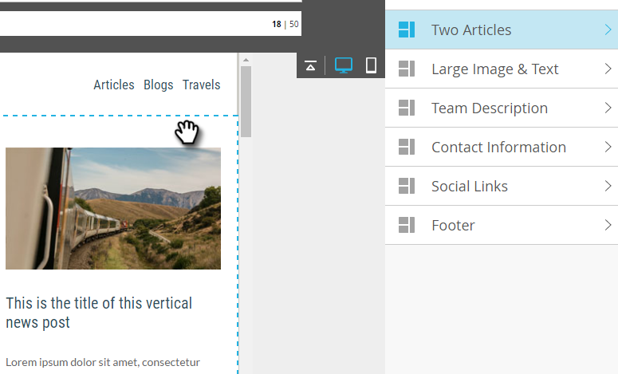

# Aggiungere moduli all’e-mail {#add-modules-to-your-email}

In [!DNL Email Editor 2.0], un modulo è una sezione dell&#39;e-mail definita nel modello. I moduli possono contenere qualsiasi combinazione di elementi, variabili e altro contenuto HTML. Aggiungerle all’e-mail è facile.

1. Creare un messaggio e-mail. Assicurati di scegliere (o creare) un modello che contiene moduli.

   

   >[!NOTE]
   >
   >La maggior parte dei Marketo [!UICONTROL Starter Templates] contiene [!UICONTROL Modules]. Puoi anche [creare ](/help/marketo/product-docs/email-marketing/general/email-editor-2/email-template-syntax.md#modules).

1. All&#39;estrema destra dell&#39;e-mail, fare clic su **[!UICONTROL Modules]**.

   

1. Scegli il modulo da aggiungere e trascinalo sull’e-mail.

   

1. Quando trascini il modulo, tra gli altri moduli viene visualizzato &quot;Rilascia qui&quot;. Rilascia il nuovo modulo dove desideri.

   

1. Attendi alcuni secondi e l’e-mail si aggiornerà automaticamente, rivelando il modulo aggiunto.

   

## Spostamento di un modulo all’interno di un messaggio e-mail {#moving-a-module-within-an-email}

Esistono due modi per spostare un modulo.

1. Identificare il modulo che si desidera spostare. Se non sai come si chiama, posiziona il cursore del mouse su di esso, che verrà evidenziato a destra.

   

1. Passa il puntatore del mouse sul modulo a destra per visualizzare la maniglia. Prendilo...

   

1. ...e trascinare il modulo nel punto desiderato.

   

1. L’altro metodo consiste nel fare clic sul modulo nell’e-mail per selezionarlo, rivelando l’icona a forma di ingranaggio.

   

1. Fare clic sull&#39;icona a forma di ingranaggio e selezionare **[!UICONTROL Move Up]** o **[!UICONTROL Move Down]**, a seconda della posizione in cui si desidera spostare il modulo.

   

È tutto qui.

>[!MORELIKETHIS]
>
>[Sintassi modello e-mail](/help/marketo/product-docs/email-marketing/general/email-editor-2/email-template-syntax.md)
