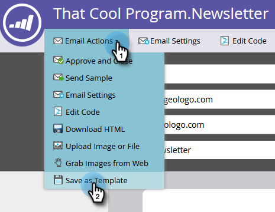

# Creare un modello e-mail {#create-an-email-template}

Segui questi passaggi per creare un nuovo modello e-mail.

>[!NOTE]
>
>Il supporto Marketo non è configurato per fornire assistenza nella risoluzione dei problemi relativi a HTML personalizzati. Per assistenza su HTML, consulta uno sviluppatore web.

>[!CAUTION]
>
>L’editor che utilizziamo converte i valori delle proprietà CSS a colori e di sfondo in minuscolo, quindi evita di usare maiuscole e minuscole e utilizza invece nomi o trattini minuscoli.

## Creare un nuovo modello e-mail {#create-a-new-email-template}

1. Fai clic su **Design Studio**.

   

1. Fai clic su **Nuovo**, quindi seleziona **Nuovo modello e-mail**.

   

1. Assegna un nome al nuovo modello e fai clic su **Crea**.

   

1. Per iniziare a modificare il nuovo modello, fai clic su **Modifica bozza**.

   

   >[!CAUTION]
   >
   >Anche se non esiste un limite rigido, una volta che un modello e-mail viene utilizzato da oltre 500 e-mail, la riapprovazione di quel modello dopo un aggiornamento potrebbe causare problemi di prestazioni. Una volta che un modello e-mail è associato a 500 e-mail, ti consigliamo di creare un nuovo modello.

## Salvare un’e-mail come modello {#save-an-email-as-a-template}

Se hai creato un messaggio e-mail che desideri salvare come modello per utilizzi futuri, segui questi semplici passaggi.

1. Fai clic su **Attività di marketing**.

   

1. Trova e seleziona il tuo indirizzo e-mail, quindi fai clic su **Modifica bozza**.

   

1. Fai clic sul pulsante **Azioni e-mail** a discesa e seleziona **Salva come modello**.

   

1. Fai clic sul pulsante **Cartella** a discesa, seleziona il punto in cui vuoi che il modello viva e fai clic su **Salva**.

   

   Ed è tutto!

   >[!CAUTION]
   >
   >Quando salvi un’e-mail come modello, i valori delle variabili non vengono riportati. Le variabili continueranno a utilizzare i valori predefiniti specificati nel modello sottostante. Anche i moduli disponibili nell’e-mail non verranno riportati a meno che non siano stati inseriti nel corpo dell’e-mail.

Per personalizzare il modello e-mail, controlla l’articolo seguente.

>[!MORELIKETHIS]
>
>[Sintassi del modello e-mail](/help/marketo/product-docs/email-marketing/general/email-editor-2/email-template-syntax.md)
