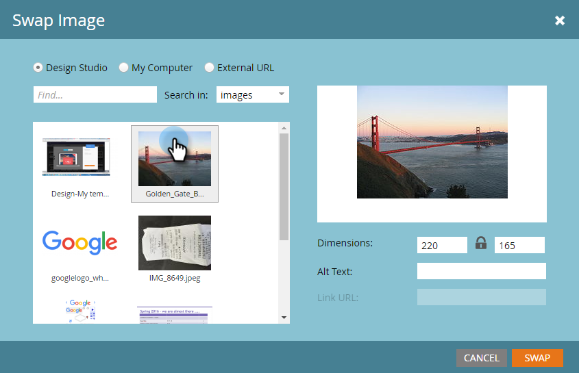
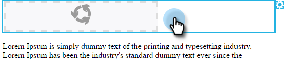

# Modificare gli elementi in un messaggio e-mail {#edit-elements-in-an-email}

Le e-mail possono contenere quattro elementi diversi: Rich text, immagini, snippet e video. Ecco come modificarli.

## Come modificare l’elemento RTF {#how-to-edit-the-rich-text-element}

1. Trova il tuo messaggio e-mail, selezionalo e fai clic su **Modifica bozza**.

   

1. Verrà aperto l’editor e-mail. Seleziona Rich text, fai clic sull’icona a forma di ingranaggio e seleziona **Modifica**.

   

   Puoi anche passare il cursore sull’elemento nel riquadro a destra, facendo apparire l’icona a forma di ingranaggio.

   

1. Aggiungi/Modifica il testo e premi **Salva**.

   

   >[!NOTE]
   >
   >Puoi anche aggiungere immagini, token, tabelle e altri elementi. Vedi [Utilizzo dell’editor Rich Text](/help/marketo/product-docs/email-marketing/general/understanding-the-email-editor/using-the-rich-text-editor.md).

   >[!CAUTION]
   >
   >Evita di copiare e incollare testo da un’origine di testo RTF, ad esempio un sito web o un documento Word. Invece, incolla prima il testo RTF in un editor di testo normale, ad esempio Blocco note (Windows) o Modifica testo (Mac). Una volta &quot;pulito&quot;, puoi copiarlo dall’editor di testo normale e incollarlo nell’e-mail.

## Come modificare l’elemento immagine {#how-to-edit-the-image-element}

1. Fai clic all’interno del modulo con l’elemento Immagine per selezionarlo.

   

1. Fai clic sull’elemento immagine da modificare, quindi fai clic sull’icona a forma di ingranaggio e seleziona **Modifica**.

   

   >[!NOTE]
   >
   >Puoi anche fare doppio clic sull’elemento per iniziare la modifica.

1. Viene visualizzato l’editor di immagini.

   

   Sono disponibili tre opzioni per l’inserimento di un’immagine. Diamo un&#39;occhiata a ciascuno.

   **External URL**

   >[!NOTE]
   >
   >Se desideri utilizzare un token Marketo, utilizza questa opzione. Tieni presente che quando utilizzi un token, l’immagine apparirà interrotta nell’editor, ma verrà riprodotta in modalità Anteprima e nell’e-mail Invia esempio.

   Per utilizzare un URL esterno, incolla prima l’URL dell’immagine. Modifica le dimensioni in base alle tue esigenze e aggiungi del testo Alt (facoltativo). Quindi premere **Scambio**.

   

   **Risorse del computer**

   Per caricare un&#39;immagine dal computer, fai clic su **Sfoglia**.

   

   Passa alla posizione dell&#39;immagine sul computer e inseriscila.

   

   Modificare le dimensioni in base alle esigenze, modificare il Testo Alt (facoltativo), quindi premere **Scambio**.

   

   >[!NOTE]
   >
   >Se sostituisci un’immagine, dovrai controllare la **Sovrascrivi immagine esistente** che appare sotto l&#39;URL/nome immagine.

   **Design Studio**

   Per inserire un&#39;immagine da Design Studio, è sufficiente individuarla...

   

   ...e inseriscilo. Modificare le dimensioni in base alle esigenze, modificare il Testo Alt (facoltativo), quindi premere **Scambio**.

   

## Come modificare l’elemento frammento {#how-to-edit-the-snippet-element}

1. Fai clic all’interno del modulo con l’elemento Snippet.

   

1. Fai clic sull’elemento Frammento , quindi sull’icona a forma di ingranaggio e seleziona **Modifica**.

   

1. Trova il tuo frammento, selezionalo e fai clic su **Salva**.

   

1. Il tuo frammento si popola.

   

## Come modificare l’elemento video {#how-to-edit-the-video-element}

1. Fai clic all’interno del modulo con l’elemento Video .

   

1. Fai clic sull’elemento video, quindi sull’icona a forma di ingranaggio e seleziona **Modifica**.

   

1. Incolla nell’URL del video da Vimeo o YouTube. Quindi fai clic fuori dalla casella URL per caricare l’anteprima. Modifica le dimensioni in base alle tue esigenze, aggiungi Testo Alt (facoltativo), quindi premi **Inserisci**.

   

   >[!NOTE]
   >
   >Per i video di YouTube, utilizza l’URL completo dalla barra degli indirizzi, non l’URL di scelta rapida trovato nell’opzione Condividi .

Divertiti a progettare l&#39;e-mail perfetta!
