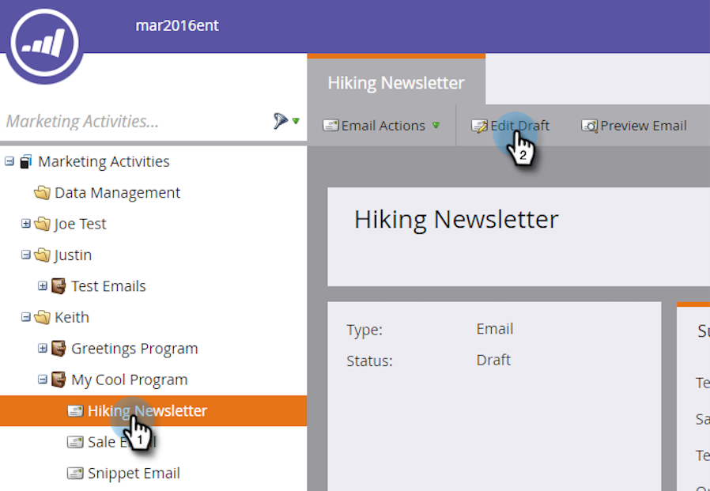

# Modificare elementi in un messaggio e-mail {#edit-elements-in-an-email}

Le e-mail possono contenere quattro elementi diversi: Testo formattato, Immagini, Snippet e Video. Ecco come modificarli.

## Come modificare l’elemento Rich Text {#how-to-edit-the-rich-text-element}

1. Trova l’e-mail, selezionala e fai clic su **Modifica bozza**.

   

1. Si aprirà l’editor e-mail. Seleziona il Testo formattato, fai clic sull’icona a forma di ingranaggio e seleziona **Modifica**.

   

   Puoi anche passare il cursore del mouse sull’elemento nel riquadro di destra, causando la visualizzazione dell’icona a forma di ingranaggio.

   

1. Aggiungere/modificare il testo e premere **Salva**.

   

   >[!NOTE]
   >
   >Puoi anche aggiungere immagini, token, tabelle e altri elementi. Consulta [Utilizzo dell’Editor Rich Text](/help/marketo/product-docs/email-marketing/general/understanding-the-email-editor/using-the-rich-text-editor.md).

   >[!CAUTION]
   >
   >Evitare di copiare e incollare testo da un&#39;origine RTF, ad esempio un sito Web o un documento di Word. Piuttosto, incolla prima il testo RTF in un editor di testo normale, ad esempio Blocco note (Windows) o TextEdit (Mac). Una volta che è &quot;pulito&quot;, puoi copiarlo dall’editor di testo normale e incollarlo nell’e-mail.

## Come modificare l’elemento immagine {#how-to-edit-the-image-element}

1. Fai clic all’interno del modulo con l’elemento Immagine per selezionarlo.

   

1. Fai clic sull’elemento Immagine da modificare, quindi fai clic sull’icona a forma di ingranaggio e seleziona **Modifica**.

   

   >[!NOTE]
   >
   >Puoi anche fare doppio clic sull’elemento per iniziare la modifica.

1. Viene visualizzato l’editor di immagini.

   

   Sono disponibili tre opzioni per l&#39;inserimento di un&#39;immagine. Guardiamo ognuno di essi.

   **URL esterno**

   >[!NOTE]
   >
   >Se desideri utilizzare un token Marketo, utilizza questa opzione. Tieni presente che quando utilizzi un token, l’immagine apparirà danneggiata nell’editor, ma verrà riprodotta in modalità Anteprima e nell’e-mail Invia campione.

   Per utilizzare un URL esterno, incolla prima l’URL dell’immagine. Modifica le dimensioni in base alle tue esigenze e aggiungi del testo alternativo (facoltativo). Quindi premere **Scambia**.

   

   **Risorse del computer**

   Per caricare un&#39;immagine dal computer, fare clic su **Sfoglia**.

   

   Passare alla posizione dell&#39;immagine nel computer e inserirla.

   

   Modificare le dimensioni in base alle proprie esigenze, modificare il testo Alt (facoltativo), quindi premere **Scambia**.

   

   >[!NOTE]
   >
   >Se stai sostituendo un&#39;immagine, dovrai controllare il **Sovrascrivi immagine esistente** che viene visualizzata sotto l’URL/nome dell’immagine.

   **Design Studio**

   Per inserire un&#39;immagine da Design Studio, è sufficiente individuarla...

   

   ...e inseriscilo. Modificare le dimensioni in base alle proprie esigenze, modificare il testo Alt (facoltativo), quindi premere **Scambia**.

   

## Come modificare l’elemento Snippet {#how-to-edit-the-snippet-element}

1. Fare clic all&#39;interno del modulo con l&#39;elemento Snippet.

   

1. Fai clic sull’elemento Snippet, quindi sull’icona a forma di ingranaggio e seleziona **Modifica**.

   

1. Trovare il frammento, selezionarlo e fare clic su **Salva**.

   

1. Lo snippet viene quindi popolato.

   

## Come modificare l’elemento video {#how-to-edit-the-video-element}

1. Fai clic all’interno del modulo con l’elemento Video.

   

1. Fai clic sull’elemento Video, quindi sull’icona a forma di ingranaggio e seleziona **Modifica**.

   

1. Incolla l’URL del video da Vimeo o YouTube. Quindi fai clic su nella casella URL per caricare l’anteprima. Modifica le dimensioni in base alle tue esigenze, aggiungi Testo alternativo (facoltativo), quindi premi **Inserisci**.

   

   >[!NOTE]
   >
   >Per i video di YouTube, utilizza l’URL completo dalla barra degli indirizzi, non l’URL del collegamento trovato nell’opzione Condividi.

Divertiti a progettare l’e-mail perfetta!
