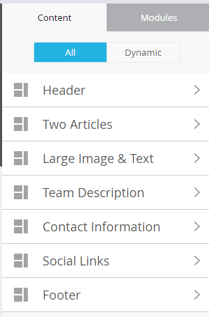
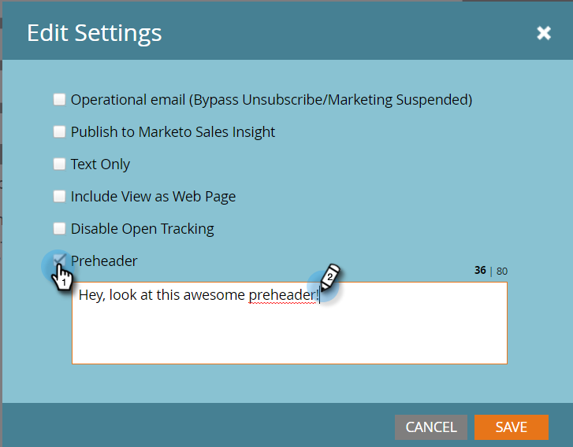

# Panoramica dell’editor di e-mail v2.0 {#email-editor-v-overview}

Quando decidi di attivare Email Editor v2.0, noterai diverse nuove funzioni.

**Selettore modello e-mail**

Quando crei un nuovo messaggio e-mail, viene visualizzata la [Selettore modello e-mail](/help/marketo/product-docs/email-marketing/general/email-editor-2/email-template-picker-overview.md).

**Editor e-mail**

Quando inizi a modificare l’e-mail, noterai che l’editor ha un aspetto completamente nuovo.

**Moduli**

Quelle cose sul lato destro dell&#39;editor si chiamano moduli. Scopri come [aggiungi moduli all’e-mail](/help/marketo/product-docs/email-marketing/general/email-editor-2/add-modules-to-your-email.md).

**Versione testo**

Il passaggio tra la versione HTML e le versioni di testo dell’e-mail ora si trova in una comoda scheda in basso. Scopri come [modifica la versione testuale di un messaggio e-mail](/help/marketo/product-docs/email-marketing/general/creating-an-email/edit-the-text-version-of-an-email.md).

**Intestazione e-mail**

Vuoi più spazio di design? L’intestazione dell’e-mail può essere nascosta al termine dell’operazione [modifica](/help/marketo/product-docs/email-marketing/general/creating-an-email/edit-your-email-header.md). Fai clic su questa icona...

...e l&#39;intestazione viene compressa.

**Anteprima dell’e-mail**

Per impostazione predefinita, l’e-mail mostra l’aspetto che avrebbe su un desktop, come indicato dall’icona blu evidenziata. Se fai clic sull&#39;icona a destra...

...vedrai come verrà eseguito il rendering dell’e-mail su un dispositivo mobile.

Per un&#39;anteprima più grande, fai clic su **Anteprima** in alto a destra nell’e-mail.

La vista predefinita è desktop...

...ma potete anche vedere come apparirà su un dispositivo mobile. Puoi anche visualizzare in anteprima la versione di testo! Fai clic su **Modifica bozza** in alto a destra per riprendere la modifica.

**Azioni e-mail**

Sotto **Azioni e-mail** Noterai alcune nuove funzioni. **Caricare un’immagine o un file** e **Acquisisci immagini dal web**. Puoi anche salvare l’e-mail stessa come nuovo modello e-mail. Tutto quello che devi fare è dargli un nome e una destinazione.

>[!CAUTION]
>
>Quando salvi un’e-mail come modello, i valori delle variabili non vengono riportati. Le variabili continueranno a utilizzare i valori predefiniti specificati nel modello sottostante. Anche i moduli disponibili nell’e-mail non verranno riportati a meno che non siano stati inseriti nel corpo dell’e-mail.

>[!NOTE]
>
>**[Acquisisci immagini dal web](/help/marketo/product-docs/demand-generation/images-and-files/grab-the-images-from-a-web-page.md)** funziona come in Design Studio.

**Disattiva tracciamento aperto** Sotto **Impostazioni e-mail**, se necessario puoi disattivare il tracciamento delle aperture.

**Impostazioni e-mail**

È possibile aggiungere una preintestazione. Una intestazione è il breve testo di riepilogo dopo la riga dell’oggetto quando le e-mail vengono visualizzate nella casella in entrata.

>[!CAUTION]
>
>I token non funzionano nella intestazione quando si utilizza l’editor e-mail. Per utilizzare un token nell’intestazione, è necessario che sia tramite il proprio HTML in un modello e-mail.

Un sacco di grandi nuove funzionalità! Divertitevi!

>[!NOTE]
>
>Se vuoi approfondire ulteriormente, consulta questo articolo [video utile](https://nation.marketo.com/videos/1463).

>[!MORELIKETHIS]
>
>[Sintassi del modello e-mail](/help/marketo/product-docs/email-marketing/general/email-editor-2/email-template-syntax.md)
