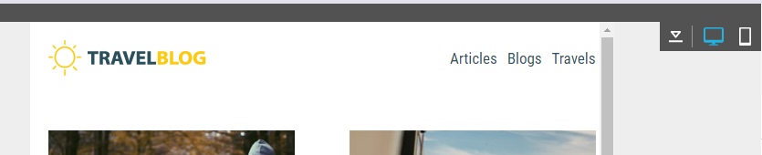
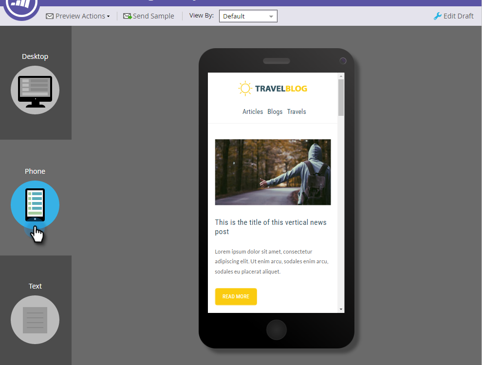

# Panoramica di Email Editor v2.0 {#email-editor-v2-overview}

Quando decidi di attivare [!DNL Email Editor v2.0], noterai diverse nuove funzionalità.

**Selettore modelli e-mail**

Quando crei una nuova e-mail, accedi al [selettore modello e-mail](/help/marketo/product-docs/email-marketing/general/email-editor-2/email-template-picker-overview.md).

**Editor e-mail**

Quando inizi a modificare l’e-mail, noterai che l’editor ha un aspetto completamente nuovo.

**Moduli**

Quegli elementi a destra dell&#39;editor sono chiamati moduli. Scopri come [aggiungere moduli alla tua e-mail](/help/marketo/product-docs/email-marketing/general/email-editor-2/add-modules-to-your-email.md).

**Versione testo**

Il passaggio tra la versione HTML e la versione Text dell’e-mail ora si trova in una pratica scheda nella parte inferiore. Scopri come [modificare la versione testuale di un&#39;e-mail](/help/marketo/product-docs/email-marketing/general/creating-an-email/edit-the-text-version-of-an-email.md).

**Intestazione e-mail**

Desideri più spazio per il design? L&#39;intestazione e-mail può essere nascosta al termine di [modifica](/help/marketo/product-docs/email-marketing/general/creating-an-email/edit-your-email-header.md). Fai clic su questa icona...

...e l’intestazione si comprime.

**Anteprima e-mail**

Per impostazione predefinita, l’e-mail mostra l’aspetto che avrebbe su un desktop, come indicato dall’icona blu evidenziata. Se fai clic sull’icona a destra...

...vedrai come verrà riprodotto il messaggio e-mail su un dispositivo mobile.

Per un&#39;anteprima più grande, fare clic su **[!UICONTROL Preview]** in alto a destra nell&#39;e-mail.

La vista predefinita è desktop...

...ma puoi anche vedere come apparirà su un dispositivo mobile. Puoi anche visualizzare in anteprima la versione del testo. Fai clic su **[!UICONTROL Edit Draft]** in alto a destra per riprendere la modifica.

**[!UICONTROL Email Actions]**

In **[!UICONTROL Email Actions]** noterai alcune nuove funzionalità. **[!UICONTROL Upload an Image or File]** e **[!UICONTROL Grab Images from Web]**. Puoi anche salvare l’e-mail stessa come nuovo modello e-mail. Tutto quello che dovete fare è dargli un nome e una destinazione.

>[!CAUTION]
>
>Quando si salva un’e-mail come modello, i valori delle variabili non vengono riportati. Le variabili continueranno a utilizzare i valori predefiniti specificati nel modello sottostante. Inoltre, i moduli disponibili nell’e-mail non vengono riportati, a meno che non siano stati inseriti nel corpo dell’e-mail.

>[!NOTE]
>
>**[[!UICONTROL Grab Images from Web]](/help/marketo/product-docs/demand-generation/images-and-files/grab-the-images-from-a-web-page.md)** funziona come in [!UICONTROL Design Studio].

**[!UICONTROL Disable Open Tracking]** In **[!UICONTROL Edit Settings]**, se necessario, puoi disabilitare il tracciamento delle aperture.

**[!UICONTROL Edit Settings]**

È possibile aggiungere [!UICONTROL Preheader]. [!UICONTROL Preheader] è il breve testo di riepilogo dopo la riga dell&#39;oggetto quando le e-mail vengono visualizzate nella casella in entrata.

>[!CAUTION]
>
>I token non funzionano in [!UICONTROL Preheader] quando si utilizza l&#39;editor e-mail. Per utilizzare un token in [!UICONTROL Preheader], è necessario che sia tramite il proprio HTML in un modello e-mail.

Nuove funzioni! Divertitevi!

>[!NOTE]
>
>Se vuoi approfondire ulteriormente, guarda questo [video](https://nation.marketo.com/videos/1463).

>[!MORELIKETHIS]
>
>[Sintassi modello e-mail](/help/marketo/product-docs/email-marketing/general/email-editor-2/email-template-syntax.md)
