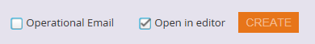

# Panoramica del selettore dei modelli e-mail {#email-template-picker-overview}

Quando [creare un messaggio e-mail](/help/marketo/product-docs/email-marketing/general/creating-an-email/create-an-email.md), puoi scegliere tra diversi modelli gratuiti. Puoi anche creare un modello personalizzato e salvarlo per utilizzi futuri.

**Nome** sarà il nome dell’e-mail creata in base al modello, non al modello stesso. **Descrizione** si applica anche all’e-mail ed è facoltativo.

Se la tua e-mail è critica e desideri che aggiri i limiti di comunicazione, [renderlo operativo](/help/marketo/product-docs/email-marketing/general/functions-in-the-editor/make-an-email-operational.md) selezionando la casella. **Apri in editor** è selezionato per impostazione predefinita e indica semplicemente che desideri iniziare a modificare il nuovo messaggio e-mail immediatamente. **Crea** significa, crea!

**Modelli iniziali** include una raccolta di modelli e-mail reattivi pronti all’uso. Puoi usarli così come sono o personalizzarli secondo le tue preferenze.

**Modelli personali** è costituito da tutti i modelli creati. Puoi anche avere delle cartelle.

Tutte le cartelle visualizzate in E-mail > Modelli nella struttura di Design Studio saranno disponibili in **Modelli personali**.

Per visualizzare un’anteprima di un modello, posiziona il cursore del mouse sulla sua miniatura e fai clic su **Anteprima**. Potete anche fare doppio clic.

Il visualizzatore di anteprima mostra come verrà eseguito il rendering del modello su un computer desktop..

...e un dispositivo mobile.

Se ti piace questo modello, scegli di farlo facendo clic su **Seleziona** in basso a destra. Vuoi continuare a guardare? Fai clic sul pulsante **X** in alto a destra. Utilizza le frecce sinistra e destra per scorrere i modelli.

Per ulteriori opzioni, puoi anche fare clic con il pulsante destro del mouse sulla miniatura di un modello.

>[!NOTE]
>
>Una cosa bella delle miniature dei modelli è che sono live. Quindi, se apporti una modifica a un modello, la miniatura cambia insieme ad esso.

Abbastanza pulito!

>[!MORELIKETHIS]
>
>* [Sintassi del modello e-mail](/help/marketo/product-docs/email-marketing/general/email-editor-2/email-template-syntax.md)
>* [Creare un messaggio e-mail](/help/marketo/product-docs/email-marketing/general/creating-an-email/create-an-email.md)

