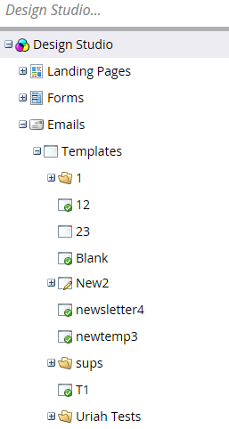

# Panoramica del selettore del modello e-mail {#email-template-picker-overview}

Quando [creare un messaggio e-mail](/help/marketo/product-docs/email-marketing/general/creating-an-email/create-an-email.md), sono disponibili diversi modelli gratuiti tra cui scegliere. Puoi anche creare un modello personalizzato e salvarlo per utilizzarlo in futuro.

**Nome** sarà il nome dell’e-mail creata in base al modello, non il modello stesso. **Descrizione** si applica anche all’e-mail ed è facoltativo.

Se la tua e-mail è fondamentale e desideri che aggiri i limiti di comunicazione, [rendilo operativo](/help/marketo/product-docs/email-marketing/general/functions-in-the-editor/make-an-email-operational.md) selezionando la casella. **Apri nell’editor** è selezionato per impostazione predefinita e indica semplicemente che desideri iniziare a modificare immediatamente la nuova e-mail. **Crea** significa creare!

**Modelli iniziali** include una raccolta di modelli e-mail dinamici pronti all’uso. Puoi utilizzarli così come sono o personalizzarli a tuo piacimento.

**Modelli personali** è costituito da tutti i modelli creati. Potresti anche avere delle cartelle.

Tutte le cartelle visualizzate in E-mail > Modelli nella struttura di Design Studio saranno disponibili in **Modelli personali**.

Per visualizzare l’anteprima di un modello, passa il cursore sulla miniatura e fai clic su **Anteprima**. È inoltre possibile fare doppio clic su di esso.

L&#39;anteprima mostra come verrà eseguito il rendering del modello su un computer desktop...

...e un dispositivo mobile.

Se ti piace questo modello, scegli facendo clic su **Seleziona** in basso a destra. Vuoi continuare a cercare? Fai clic su **X** in alto a destra. Utilizza le frecce sinistra e destra per scorrere tra i modelli.

Per ulteriori opzioni, puoi anche fare clic con il pulsante destro del mouse sulla miniatura di un modello.

>[!NOTE]
>
>Un aspetto interessante delle miniature dei modelli è che sono live. Pertanto, se si apporta una modifica a un modello, la miniatura cambia insieme a esso.

Abbastanza pulito!

>[!MORELIKETHIS]
>
>* [Sintassi del modello e-mail](/help/marketo/product-docs/email-marketing/general/email-editor-2/email-template-syntax.md)
>* [Creare un messaggio e-mail](/help/marketo/product-docs/email-marketing/general/creating-an-email/create-an-email.md)
