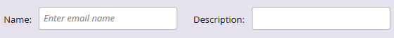

# Panoramica del selettore dei modelli e-mail {#email-template-picker-overview}

Quando [create un&#39;e-mail](/help/marketo/product-docs/email-marketing/general/creating-an-email/create-an-email.md), potete scegliere tra diversi modelli gratuiti. Potete anche creare un modello personalizzato e salvarlo per un utilizzo futuro.

**Il** nome sarà il nome dell’e-mail che create in base al modello, non il modello stesso. **La** descrizione viene applicata anche all’e-mail ed è facoltativa.

Se l&#39;e-mail è importante e si desidera aggirare i limiti di comunicazione, [renderla operativa](/help/marketo/product-docs/email-marketing/general/functions-in-the-editor/make-an-email-operational.md) selezionando la casella. **Per impostazione predefinita, l’opzione Apri nell’** editor è selezionata e consente di iniziare subito a modificare il nuovo messaggio e-mail. **** Creatori, create!

**I** modelli iniziali includono una raccolta di modelli e-mail reattivi pronti per l’uso. Puoi usarli così come sono o personalizzarli a piacimento.

>[!NOTE]
>
>I modelli iniziali di Marketo vengono offerti gratuitamente a tutti i clienti. Anche se verranno aggiornati in modo continuo e ottimizzati per i principali client e-mail (e dispositivi mobili), devi sempre valutare se soddisfano le tue esigenze. Lo [Strumento per la distribuzione tramite e-mail](/help/marketo/product-docs/email-marketing/deliverability/email-deliverability-tool.md) di Marketo può mostrare i rendering dei modelli su diversi client e-mail. Sfortunatamente, Marketo non può accettare richieste di progettazione al di fuori dei contratti di assistenza a pagamento.

**I miei** modelli sono composti di tutti i modelli che avete creato. Potete anche avere delle cartelle.

Tutte le cartelle visualizzate in E-mail > Modelli nella struttura di Design Studio saranno disponibili in **My Templates**.

Per visualizzare l&#39;anteprima di un modello, posizionate il puntatore sulla relativa miniatura e fate clic su **Anteprima**. Potete anche fare doppio clic su di esso.

L’anteprima mostra il rendering del modello su un computer desktop.

...e un dispositivo mobile.

Se ti piace questo modello, scegli il modello facendo clic su **Seleziona** in basso a destra. Vuoi continuare a guardare? Fare clic su **X** in alto a destra. Usate le frecce destra e sinistra per scorrere i modelli.

Potete anche fare clic con il pulsante destro del mouse sulla miniatura di un modello per visualizzare ulteriori opzioni.

>[!NOTE]
>
>Una cosa fantastica delle miniature dei modelli è che sono live. Quindi se modificate un modello, la miniatura cambia insieme ad esso.

Abbastanza pulito!

>[!MORELIKETHIS]
>
>* [Sintassi modello e-mail](/help/marketo/product-docs/email-marketing/general/email-editor-2/email-template-syntax.md)
>* [Creare un messaggio e-mail](/help/marketo/product-docs/email-marketing/general/creating-an-email/create-an-email.md)

