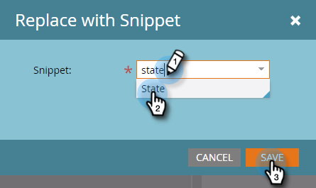

# Aggiungere uno snippet a un messaggio e-mail {#add-a-snippet-to-an-email}

I snippet sono blocchi di testo RTF e di grafica riutilizzabili che è possibile utilizzare nelle e-mail e nelle pagine di destinazione.

>[!PREREQUISITES]
>
>[Creare uno snippet](/help/marketo/product-docs/personalization/segmentation-and-snippets/snippets/create-a-snippet.md)

>[!NOTE]
>
>Non è possibile incorporare [Sintassi e-mail Marketo](/help/marketo/product-docs/email-marketing/general/email-editor-2/email-template-syntax.md)in snippet; **non** lavorare in un’e-mail. I frammenti devono essere solo contenuto del corpo (HTML + TESTO).

1. Trova l’e-mail, selezionala e fai clic su **Modifica bozza**.

   

1. Seleziona l’area modificabile da convertire in snippet, fai clic sull’icona a forma di ingranaggio e seleziona **Sostituisci con snippet**.

   

1. Seleziona lo snippet desiderato e fai clic su **Salva**.

   

   >[!NOTE]
   >
   >Nel menu a discesa vengono visualizzati solo gli snippet approvati.

   

   >[!NOTE]
   >
   >Ogni volta che aggiorni e approvi il frammento di codice, le modifiche verranno riportate nell’e-mail. L’e-mail verrà redatta a meno che tu non approvi lo snippet con [Nessuna bozza](/help/marketo/product-docs/administration/users-and-roles/enable-no-draft-for-snippets.md).

Si tratta di un modo rapido e semplice per riutilizzare i contenuti dinamici.
