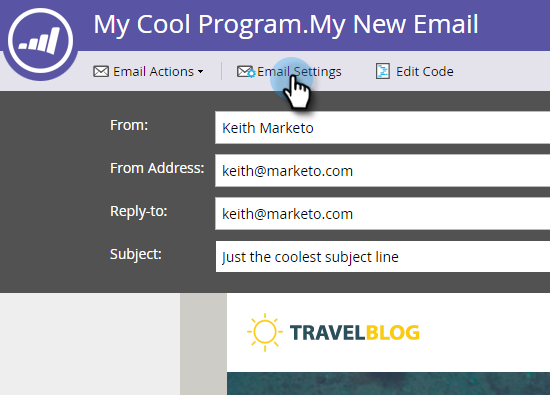
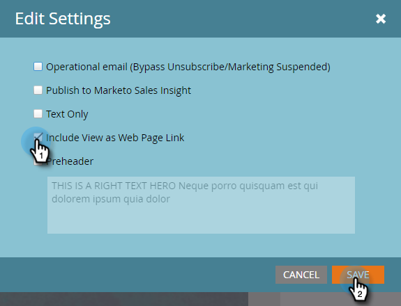

# Aggiungere un collegamento Visualizza come pagina web a un’e-mail {#add-a-view-as-web-page-link-to-an-email}

Le e-mail hanno funzionalità limitate (CSS limitate e nessun JavaScript o modulo). Utilizza Visualizza come pagina web per fornire un collegamento che consenta di visualizzare l’e-mail in un browser. Il destinatario verrà cookie utilizzando [!DNL Munchkin].

>[!NOTE]
>
>* Durante la creazione di una nuova e-mail, l’opzione Visualizza come pagina web non è abilitata. Se lo abiliti e cloni l’e-mail, questa impostazione verrà copiata.
>
>* I collegamenti &quot;Visualizza come pagina web&quot; scadono dopo sei mesi.

1. Selezionare l&#39;indirizzo di posta elettronica e fare clic su **[!UICONTROL Edit Draft]**.

   

1. Nell&#39;editor di posta elettronica fare clic su **[!UICONTROL Email Settings]**.

   

1. Selezionare la casella **[!UICONTROL Include View as Web Page Link]** e fare clic su **[!UICONTROL Save]**.

   

Ecco un esempio:

>[!TIP]
>
>Il collegamento Visualizza come pagina web viene visualizzato solo dopo l’invio dell’e-mail. Invia un test da visualizzare.

Per modificare il testo predefinito, vedere [Modificare il messaggio &quot;Visualizza come pagina Web&quot;](/help/marketo/product-docs/administration/email-setup/edit-the-view-as-web-page-message.md).
