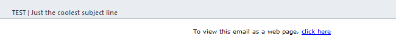

# Aggiungere una visualizzazione come collegamento a una pagina web a un’e-mail {#add-a-view-as-web-page-link-to-an-email}

Le e-mail hanno funzionalità limitate (CSS limitati e nessun JavaScript o moduli). Utilizza Visualizza come pagina web per fornire un collegamento che consenta di visualizzare l’e-mail in un browser. Verrà eseguito il cookie del destinatario utilizzando Munchkin.

>[!NOTE]
>
>Durante la creazione di un nuovo messaggio e-mail, Visualizza come pagina web non è abilitato. Se lo abiliti e cloni l’e-mail, questa impostazione verrà copiata.

1. Seleziona l’e-mail e fai clic su **Modifica bozza**.

   

1. Nell’editor e-mail, fai clic su **Impostazioni e-mail**.

   

1. Controlla la **Includi visualizzazione come pagina web** e fai clic su **Salva**.

   

Ecco un esempio di come si presenta:

>[!TIP]
>
>Il collegamento Visualizza come pagina web verrà visualizzato solo dopo l’invio dell’e-mail. Inviati un test da visualizzare.

Per modificare il testo predefinito, vedi [Modificare il messaggio &quot;Visualizza come pagina web&quot;](/help/marketo/product-docs/administration/email-setup/edit-the-view-as-web-page-message.md).
