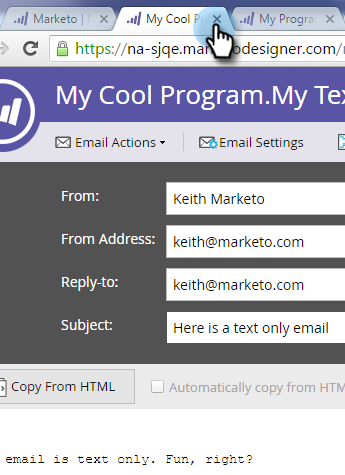

# Aggiungere collegamenti tracciati a un messaggio e-mail di testo {#add-tracked-links-to-a-text-email}

>[!PREREQUISITES]
>
>* [Creare un messaggio e-mail di solo testo](/help/marketo/product-docs/email-marketing/general/creating-an-email/create-a-text-only-email.md)
>* [Modificare elementi in un messaggio e-mail](/help/marketo/product-docs/email-marketing/general/email-editor-2/edit-elements-in-an-email.md)

I collegamenti e-mail di testo possono essere tracciati in Marketo. Vediamo come funziona. 1. Seleziona l’e-mail e fai clic su Modifica bozza.

1. Fare doppio clic sull&#39;area modificabile a cui si desidera aggiungere il collegamento.

   

1. Inserisci l’URL tra parentesi quadre, come segue: `[[www.domain.com/path/page.html]]`.

   

1. Chiudi l’editor e non dimenticare di approvare la bozza.

   

>[!NOTE]
>
>La funzionalità di classe mktNoTok non funziona con collegamenti tracciabili nelle e-mail di testo. Solo per e-mail HTML.

>[!TIP]
>
>Esegui il test per ricontrollare. Assicurarsi di aver inserito correttamente le parentesi.

Ottimo lavoro. 
