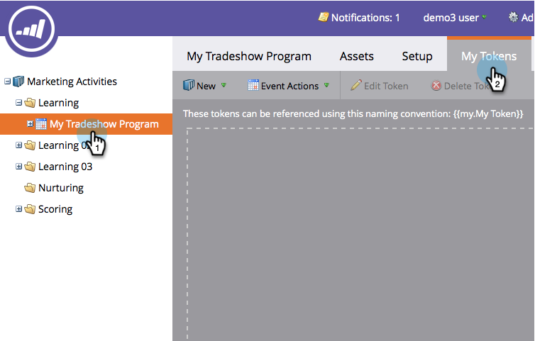

# Creare un file evento calendario (.ics) {#create-a-calendar-event-ics-file}

Un token File calendario consente di aggiungere un collegamento evento calendario (.ics) alle e-mail e alle pagine di destinazione di Marketo.

1. All&#39;interno del programma, vai a **Token personali** scheda .

   

1. Trascina un **File di calendario** token nell&#39;area di lavoro.

   

1. Inserisci un **Nome token** e **Modifica**.

   

1. Immetti i dettagli e fai clic su **Salva**.

   

Missione compiuta! Assicurati di testarlo.

>[!MORELIKETHIS]
>
>* [Includere un evento calendario (.ics) in un messaggio e-mail](/help/marketo/product-docs/email-marketing/general/functions-in-the-editor/include-a-calendar-event-ics-in-an-email.md)
>* [Includere un file ICS evento calendario in una pagina di destinazione](/help/marketo/product-docs/demand-generation/landing-pages/personalizing-landing-pages/include-a-calendar-event-ics-file-in-a-landing-page.md)

