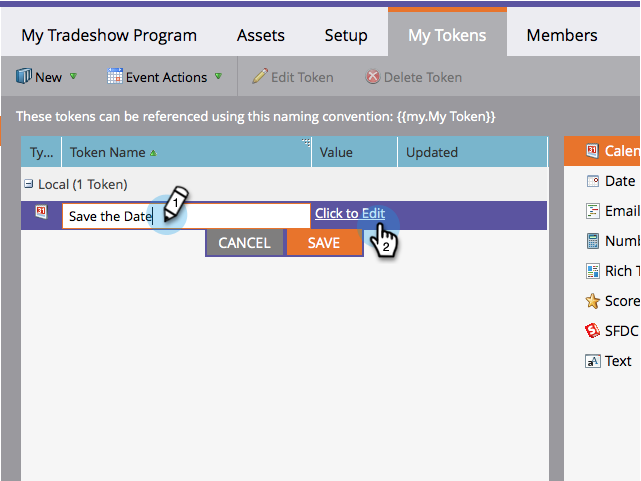

# Creare un file evento calendario (.ics) {#create-a-calendar-event-ics-file}

Un token per file di calendario consente di aggiungere un collegamento evento di calendario (.ics) alle e-mail e alle pagine di destinazione di Marketo.

1. All&#39;interno del tuo programma, vai alla scheda **My Tokens** .

   

1. Trascinate il token del file **di** calendario sul quadro.

   

1. Immettete un nome **** token e **modificate**.

   

1. Immettete i dettagli e fate clic su **Salva**.

   

Missione compiuta! Assicuratevi di testarlo.

>[!NOTE]
>
>**Articoli correlati**
>
>* [Includi un evento del calendario (.ics) in un messaggio e-mail](include-a-calendar-event-ics-in-an-email.md)
>* [Includere un file ICS evento del calendario in una pagina di destinazione](../../../../product-docs/demand-generation/landing-pages/personalizing-landing-pages/include-a-calendar-event-ics-file-in-a-landing-page.md)

>

